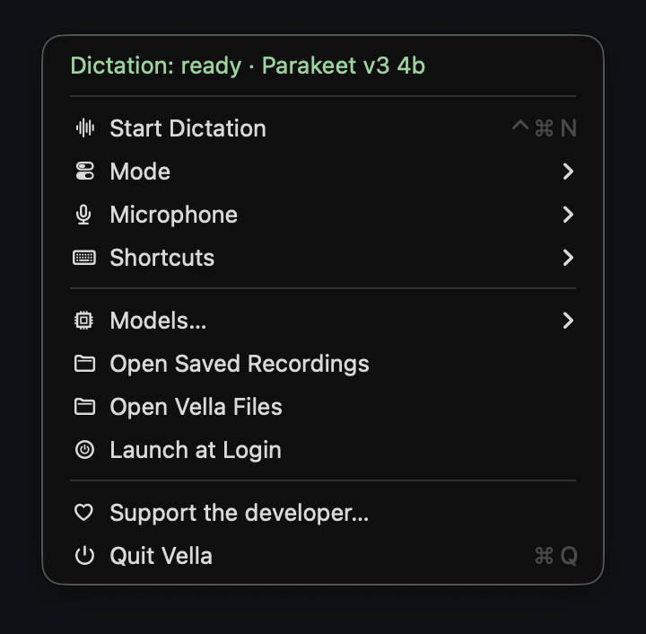
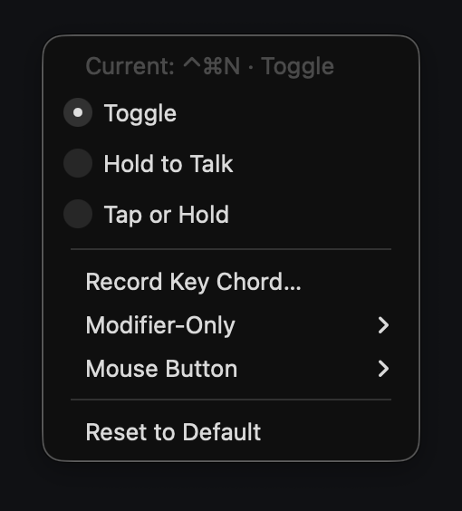
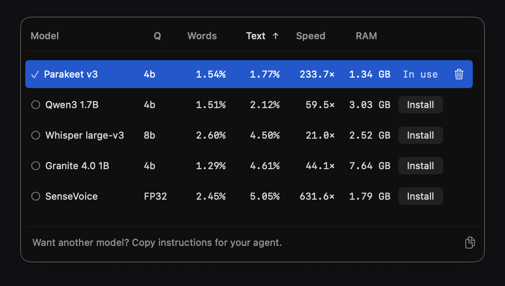
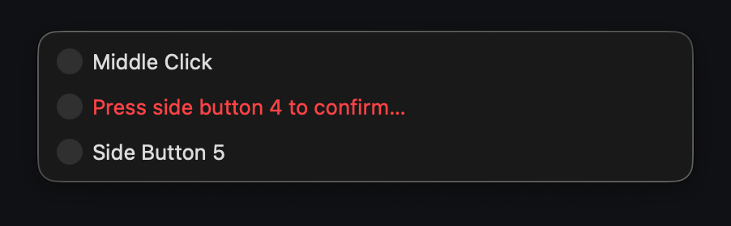

<p align="center">
  
</p>

<h1 align="center">Vella</h1>

<p align="center">Offline dictation and live transcription for Apple Silicon Macs.</p>

<p align="center">
  <a href="#install"></a>
  &nbsp;
  <a href="https://github.com/sponsors/TobyNoSkillSon"></a>
</p>

<p align="center">
  <a href="#how-it-works">How it works</a> ·
  <a href="#benchmarks">Benchmarks</a> ·
  <a href="#questions">Questions</a> ·
  <a href="docs/USAGE.md">User guide</a>
</p>

Vella lives in your menu bar. Insert a finished transcript or let words appear as you speak—with selectable local models and no audio uploads.

<p align="center">
  
  
</p>

*Captured from the current native interface using sample recording and progress states.*

- **Two ways to dictate.** Insert after Finish, or stream text as you speak.
- **Choose your model.** Keep different local models for Dictation and Streaming.
- **Recover your work.** Audio and transcripts are saved locally; retry failed transcription from the recording.
- **No automatic Send.** Vella inserts text, never presses Enter or sends the message.

## Install

**Apple Silicon · macOS 14 or newer · Beta**

```sh
curl -fsSL https://tobynoskillson.github.io/Vella/install.sh | bash
```

Builds Vella into `~/Applications` using Apple's free Command Line Tools and Python 3.12–3.14. If a prerequisite is missing, the installer explains what to install. A new installation downloads **Parakeet Q4 (~637 MB)**; existing models and settings are preserved. No paid developer membership is needed.

Open Vella, approve Microphone and Accessibility access, then press **Control + Command + N** to start. Press again to finish.

<details>
<summary>Updating an existing installation</summary>

Finish any recording or transcription first, then rerun the command above. The stable URL currently serves **v0.8.8** and may advance after a future verified release. Models, recordings and settings are preserved. You may need to approve macOS permissions again after an update.

Vella checks for a newer stable release after use, at most once per calendar day, and links to its release page. It never installs updates automatically.

[Releases](https://github.com/TobyNoSkillSon/Vella/releases) · [Installer details and verification limits](docs/USAGE.md)

</details>

## How it works

| Mode | What happens |
|---|---|
| **Dictation** | Speak, click your destination field, then finish. Vella transcribes and pastes there. If focus changes before insertion, the text stays on your clipboard instead. |
| **Streaming** | Text appears as it is recognized, wherever keyboard focus is. Pending words follow focus when you switch fields. Pause speech or close the microphone while navigating. |

Choose **Mode**, then open **Models** to install and select a model for that mode. Streaming needs a supported Streaming model; **Nemotron 8-bit** is the starting choice.

<p align="center">
  
  
</p>

<p align="center">
  
</p>

<p align="center">
  
</p>

Captured from current source with sample settings. The model table displays reference benchmarks, not measurements of your Mac. Shortcut customization is not included in the pinned v0.8.8 installer yet.

<details>
<summary>Custom shortcuts — available in source builds</summary>

The current source adds **Shortcuts** directly below **Microphone**. This is **not yet included in the pinned v0.8.8 installer**.

Choose a key combination, a left/right modifier, or a middle/side mouse button. Keep **Toggle**, use **Hold to Talk**, or combine both with **Tap or Hold** (300 ms). The default remains **⌃⌘N · Toggle**.

Mouse buttons are confirmed with one press and release in the menu; that click never starts recording. If Vella does not detect the requested button within 10 seconds, it keeps your previous shortcut. Fn and mouse-event delivery depend on your hardware and macOS configuration.

[Shortcut behavior, confirmation and troubleshooting](docs/USAGE.md)

</details>

## Benchmarks

**[Explore the interactive model comparison →](https://tobynoskillson.github.io/Vella/)**

Sort by recognition error, speed or memory, and inspect the source measurements. The published runs use 144 English reading clips from 34 speakers on an **Apple M5 Max with 128 GiB RAM**. They are not a comparison against competing apps or a guarantee for noisy rooms and other languages.

<details>
<summary>Full measurements and test conditions</summary>

**[Open the sortable benchmark table ↗](https://tobynoskillson.github.io/Vella/)**

The two error columns answer different questions. **Lower is better for both.**

- **Word-only error** (“Words” in the menu): how many words were wrong, missing or added. It ignores punctuation and capitals. This is word error rate, or WER.
- **Full-text error** (“Text” in the menu): how closely the finished transcript matches the reference, **including punctuation and capitals**. It counts edits per character, not per word. This is character error rate, or CER.

**Sorted by full-text error, lowest first**—the same default used in the app. That makes punctuation and capitalization part of the comparison, rather than ranking on word recognition alone.

Recorded on **Apple M5 Max · 128 GiB RAM**, using 144 English reading clips from 34 speakers (20m 15s). ★ marks a Dictation recommendation. † marks a batch-benchmarked candidate outside the Dictation catalog; native Streaming measurements appear separately below.

### Dictation / batch inference

<!-- BENCHMARK_RESULTS_START -->

| Model | Word-only error | Full-text error ↓ | Warm speed | Warm MLX memory |
|---|---:|---:|---:|---:|
| [Parakeet v3 4-bit](https://huggingface.co/animaslabs/parakeet-tdt-0.6b-v3-mlx-4bit) ★ | 1.54% | 1.77% | 233.7× | 1.34 GB |
| [Parakeet v3 8-bit](https://huggingface.co/animaslabs/parakeet-tdt-0.6b-v3-mlx-8bit) | 1.60% | 1.85% | 237.4× | 1.61 GB |
| [Qwen3 0.6B 4-bit](https://huggingface.co/mlx-community/Qwen3-ASR-0.6B-4bit) † | 1.54% | 2.07% | 88.6× | 1.93 GB |
| [Qwen3 1.7B BF16](https://huggingface.co/mlx-community/Qwen3-ASR-1.7B-bf16) | 1.41% | 2.08% | 30.5× | 5.50 GB |
| [Qwen3 1.7B 4-bit](https://huggingface.co/mlx-community/Qwen3-ASR-1.7B-4bit) ★ | 1.51% | 2.12% | 59.5× | 3.03 GB |
| [Qwen3 1.7B 8-bit](https://huggingface.co/mlx-community/Qwen3-ASR-1.7B-8bit) | 1.57% | 2.14% | 44.5× | 3.89 GB |
| [Nemotron 3.5 ASR 0.6B 8-bit](https://huggingface.co/mlx-community/nemotron-3.5-asr-streaming-0.6b-8bit) † | 2.64% | 2.53% | 52.9× | 0.99 GB |
| [Voxtral Mini Realtime 4B 4-bit](https://huggingface.co/mlx-community/Voxtral-Mini-4B-Realtime-2602-4bit) † | 2.26% | 2.57% | 5.1× | 5.94 GB |
| [Whisper large-v3 8-bit](https://huggingface.co/mlx-community/whisper-large-v3-8bit) ★ | 2.60% | 4.50% | 21.0× | 2.52 GB |
| [Granite 4.0 1B 4-bit](https://huggingface.co/mlx-community/granite-4.0-1b-speech-4bit) ★ | 1.29% | 4.61% | 44.1× | 7.64 GB |
| [Granite 4.0 1B 8-bit](https://huggingface.co/mlx-community/granite-4.0-1b-speech-8bit) | 1.19% | 4.61% | 37.4× | 8.56 GB |
| [Whisper large-v3 FP16](https://huggingface.co/mlx-community/whisper-large-v3-asr-fp16) | 2.82% | 4.76% | 19.7× | 4.03 GB |
| [SenseVoice FP32](https://huggingface.co/mlx-community/SenseVoiceSmall) ★ | 2.45% | 5.05% | 631.6× | 1.79 GB |
| [SenseVoice 4-bit](https://huggingface.co/vanch007/SenseVoiceSmall-4bit) | 3.45% | 5.40% | 582.3× | 0.88 GB |
| [Granite Speech 5.0 TurboCTC 470M FP16](https://huggingface.co/iky1e/granite-speech-5.0-470m-turboctc-mlx-fp16) † | 3.70% | 5.87% | 654.0× | 1.59 GB |
| [Whisper large-v3 4-bit](https://huggingface.co/mlx-community/whisper-large-v3-asr-4bit) | 4.14% | 6.30% | 22.2× | 1.75 GB |

<!-- BENCHMARK_RESULTS_END -->

Speed compares audio length with transcription time after the model is loaded; 60× means a minute of audio takes about a second of inference. Memory is the measured MLX allocation, **not total app memory**. Accuracy and speed use two passes per clip; memory was measured separately. These are clean-reading results, not a guarantee for every voice or noisy room.

[Full measurements](Resources/ReferenceResults/) · [How the scores are calculated](Resources/benchmark-policy.json)

### Streaming / native incremental input

**The same 144 clips, audio hashes, references and scoring as the table above**, fed through Vella's actual streaming worker in 100-ms packets. Two timing passes per clip. Nemotron uses its supported 320-ms context; Voxtral uses a configured 480-ms delay. Neither setting is measured microphone-to-word latency.

<!-- STREAMING_RESULTS_START -->

| Model | Word-only error | Full-text error ↓ | Streaming compute speed | Warm MLX memory |
|---|---:|---:|---:|---:|
| [Nemotron 3.5 ASR 0.6B 8-bit](https://huggingface.co/mlx-community/nemotron-3.5-asr-streaming-0.6b-8bit) | 2.95% | 2.66% | 15.3× | 0.98 GB |
| [Nemotron 3.5 ASR 0.6B BF16](https://huggingface.co/mlx-community/nemotron-3.5-asr-streaming-0.6b) | 2.86% | 2.66% | 8.1× | 2.22 GB |
| [Voxtral Mini Realtime 4B 4-bit](https://huggingface.co/mlx-community/Voxtral-Mini-4B-Realtime-2602-4bit) | 2.35% | 2.71% | 1.2× | 5.56 GB ‡ |

<!-- STREAMING_RESULTS_END -->

‡ Voxtral's warm MLX peak was measured during its completed two-pass timing run, not a separate memory profile. Nemotron memory uses separate full-suite one-pass measurements. All values are actual MLX allocation peaks, not total process RAM.

On this corpus, Nemotron 8-bit is the efficient starting choice. BF16 changes a few words without lowering full-text error; Voxtral improves word recognition but runs only slightly faster than real time.

Streaming speed is accelerated compute throughput, excluding loading, IPC and inter-clip reset—not how quickly words appear after you speak. Accuracy includes the normal streaming gate, partials and final flush; these are not the batch scores reused under another label. This clean-English corpus does not establish multilingual accuracy or day-long microphone endurance.

The September 2026 VibeVoice streaming release and Moonshine v2 were screened but not benchmarked: Vella's pinned MLX runtime lacks their native input-streaming implementations. Moonshine's current official engine would require a separate runtime integration. No untested scores or placeholder model choices are included.

</details>

## Questions

<details>
<summary>Does Vella work without an internet connection?</summary>

Yes, after the model and runtime downloads. Vella does not upload audio or transcripts. Model downloads and the release-update check use the network; the latter sends a normal GitHub HTTPS request, never speech data. Apps you dictate into may sync your text under their own settings. Clipboard managers and Universal Clipboard may also see copied or pasted text.

</details>

<details>
<summary>Where are my recordings? What happens if transcription fails?</summary>

Choose **Open Saved Recordings** in the menu. Vella retains audio and transcripts locally until you delete them, including after successful insertion. Genuine transcription failures can be retried from saved audio; recovery copies text to the clipboard instead of inserting it into an old destination.

There is no recording timer, but available disk space limits recording length. Empty recognition is a normal successful result, not an automatic reason to retry.

</details>

<details>
<summary>Why does it need Microphone and Accessibility access?</summary>

Microphone access captures your voice. Accessibility lets Vella insert text into other apps and observe supported optional activation inputs. Text insertion depends on the target app; some terminals and custom editors behave differently. Vella never presses Enter or Send.

</details>

<details>
<summary>How do I uninstall it?</summary>

Quit Vella and move the app to Trash. Models, settings and recordings remain in `~/Library/Application Support/Vella`. Delete that folder separately only if you want to remove those files too.

</details>

---

[Support Vella](https://github.com/sponsors/TobyNoSkillSon) · [User guide](docs/USAGE.md) · [Model integration guide](Resources/AGENT_GUIDE.md) · [Report a bug](https://github.com/TobyNoSkillSon/Vella/issues) · [Releases](https://github.com/TobyNoSkillSon/Vella/releases) · [Apache 2.0 license](LICENSE) · [Third-party notices](THIRD_PARTY_NOTICES.md)

<p align="center">
  <a href="https://github.com/TobyNoSkillSon/Vella/actions/workflows/source-checks.yml"></a>
</p>
