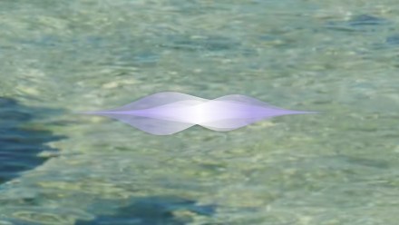
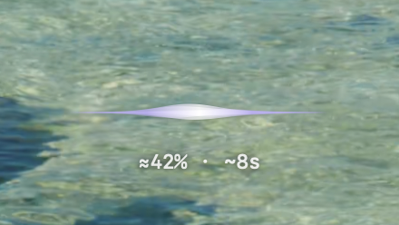

# Vella

Dictation for your Mac. Press **⌃⌘N**, speak, then press it again to put the text where your cursor was.

Vella lives in the menu bar and transcribes on your Mac. No account or subscription.

## A look inside

The waveform appears while you speak. Longer jobs also show an estimated time remaining.

| Recording | Transcribing |
|:---:|:---:|
|  |  |


Pick a microphone, start recording, or open your saved transcripts from the menu. Open **Models** to choose what handles the transcription.


*Rendered interface previews. The table shows reference benchmarks; results vary by Mac.*

## Install

For **Apple Silicon Macs running macOS 14 or newer**.

```sh
curl --fail --location --proto '=https' --proto-redir '=https' \
  https://raw.githubusercontent.com/TobyNoSkillSon/Vella/v0.6.0/scripts/install.sh | bash
```

The installer builds Vella and puts it in `~/Applications`. It needs Apple's free Command Line Tools and Python 3.12–3.14; if either is missing, it'll tell you how to install it. No paid developer membership is needed.

Vella is a beta. macOS will ask for Microphone and Accessibility access, and you may need to approve permissions again after an update.

## Get started

1. Open Vella, then **Models**.
2. Click **Install** beside **Parakeet Q4**, then **Use**. That's a good starting point for English.
3. Click a text field and press **Control + Command + N** to record. Press it again when you're done.

A small waveform appears while you speak. Vella pastes the finished text but never presses Enter or Send. If you move to another window or field, it leaves the text on your clipboard instead.

## Measured performance

The two error columns answer different questions. **Lower is better for both.**

- **Word-only error** (“Words” in the menu): how many words were wrong, missing or added. It ignores punctuation and capitals. This is word error rate, or WER.
- **Full-text error** (“Text” in the menu): how closely the finished transcript matches the reference, **including punctuation and capitals**. It counts edits per character, not per word. This is character error rate, or CER.

**Sorted by full-text error, lowest first**—the same default used in the app. That makes punctuation and capitalization part of the comparison, rather than ranking on word recognition alone.

Recorded on **Apple M5 Max · 128 GiB RAM**, using 144 English reading clips from 34 speakers (20m 15s). ★ marks a recommended variant.

<!-- BENCHMARK_RESULTS_START -->

| Model | Version | Word-only error | Full-text error ↓ | Warm speed | Warm MLX memory |
|---|---|---:|---:|---:|---:|
| Parakeet v3 ★ | 4-bit | 1.54% | 1.77% | 233.7× | 1.34 GB |
| Parakeet v3 | 8-bit | 1.60% | 1.85% | 237.4× | 1.61 GB |
| Qwen3 1.7B | BF16 | 1.41% | 2.08% | 30.5× | 5.50 GB |
| Qwen3 1.7B ★ | 4-bit | 1.51% | 2.12% | 59.5× | 3.03 GB |
| Qwen3 1.7B | 8-bit | 1.57% | 2.14% | 44.5× | 3.89 GB |
| Whisper large-v3 ★ | 8-bit | 2.60% | 4.50% | 21.0× | 2.52 GB |
| Granite 4.0 1B ★ | 4-bit | 1.29% | 4.61% | 44.1× | 7.64 GB |
| Granite 4.0 1B | 8-bit | 1.19% | 4.61% | 37.4× | 8.56 GB |
| Whisper large-v3 | FP16 | 2.82% | 4.76% | 19.7× | 4.03 GB |
| SenseVoice ★ | FP32 | 2.45% | 5.05% | 631.6× | 1.79 GB |
| SenseVoice | 4-bit | 3.45% | 5.40% | 582.3× | 0.88 GB |
| Whisper large-v3 | 4-bit | 4.14% | 6.30% | 22.2× | 1.75 GB |

<!-- BENCHMARK_RESULTS_END -->

Speed compares audio length with transcription time after the model is loaded; 60× means a minute of audio takes about a second of inference. Memory is the measured MLX allocation, **not total app memory**. Accuracy and speed use two passes per clip; memory was measured separately. These are clean-reading results, not a guarantee for every voice or noisy room.

[Full measurements](Resources/ReferenceResults/) · [How the scores are calculated](Resources/benchmark-policy.json)

## Your recordings

Transcription works offline once you've downloaded a model. **Recordings and transcripts stay on your Mac until you delete them**, even after a successful paste. Choose **Open Saved Recordings** to find them.

There's no recording timer, but you'll need enough disk space. If transcription fails, your saved audio is there to retry. Clipboard managers and Universal Clipboard can still see text you copy or paste.

To uninstall, quit Vella and move the app to Trash. Your recordings and models remain in `~/Library/Application Support/Vella`; delete that folder separately only if you want to remove them too.

---

[Releases](https://github.com/TobyNoSkillSon/Vella/releases) · [Benchmarks](Resources/ReferenceResults/) · [Developer guide](Resources/AGENT_GUIDE.md) · [Apache 2.0 license](LICENSE) · [Third-party notices](THIRD_PARTY_NOTICES.md)
