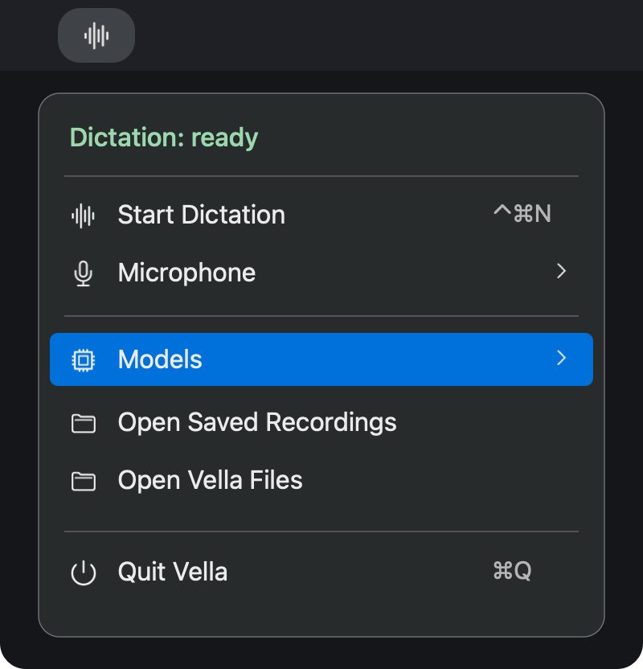
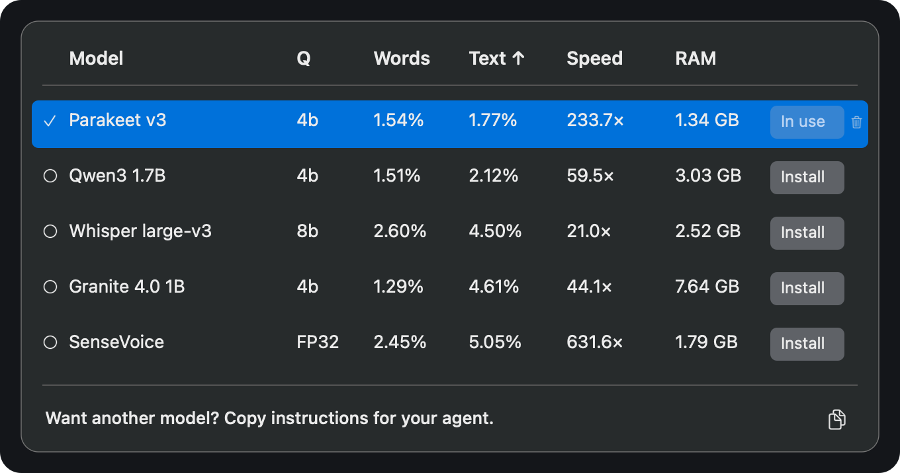

# Vella

Dictation for your Mac. Press **⌃⌘N**, speak, then press it again to put the text where your cursor was.

Vella lives in the menu bar and transcribes on your Mac. No account or subscription.

## A look inside



Pick a microphone, start recording, or open your saved transcripts from the menu. Open **Models** to choose what handles the transcription.



*Rendered interface previews. The table shows reference benchmarks; results vary by Mac.*

## Install

For **Apple Silicon Macs running macOS 14 or newer**.

```sh
curl --fail --location --proto '=https' --proto-redir '=https' \
  https://raw.githubusercontent.com/TobyNoSkillSon/Vella/v0.6.0/scripts/install.sh | bash
```

The installer builds Vella and puts it in `~/Applications`. It needs Apple's free Command Line Tools and Python 3.12–3.14; if either is missing, it'll tell you how to install it. No paid developer membership is needed.

Vella is a beta. macOS will ask for Microphone and Accessibility access, and you may need to approve permissions again after an update.

## Get started

1. Open Vella, then **Models**.
2. Click **Install** beside **Parakeet Q4**, then **Use**. That's a good starting point for English.
3. Click a text field and press **Control + Command + N** to record. Press it again when you're done.

A small waveform appears while you speak. Vella pastes the finished text but never presses Enter or Send. If you move to another window or field, it leaves the text on your clipboard instead.

## Your recordings

Transcription works offline once you've downloaded a model. **Recordings and transcripts stay on your Mac until you delete them**, even after a successful paste. Choose **Open Saved Recordings** to find them.

There's no recording timer, but you'll need enough disk space. If transcription fails, your saved audio is there to retry. Clipboard managers and Universal Clipboard can still see text you copy or paste.

To uninstall, quit Vella and move the app to Trash. Your recordings and models remain in `~/Library/Application Support/Vella`; delete that folder separately only if you want to remove them too.

---

[Releases](https://github.com/TobyNoSkillSon/Vella/releases) · [Benchmarks](Resources/ReferenceResults/) · [Developer guide](Resources/AGENT_GUIDE.md) · [Apache 2.0 license](LICENSE) · [Third-party notices](THIRD_PARTY_NOTICES.md)
