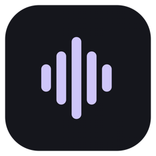

<p align="center">
  
</p>

<h1 align="center">Vella</h1>

<p align="center">Offline dictation and live transcription for Apple Silicon Macs.</p>

<p align="center">
  <a href="#install"></a>
  &nbsp;
  <a href="https://github.com/sponsors/TobyNoSkillSon"></a>
</p>

<p align="center">
  <a href="#models">Models</a> ·
  <a href="#the-app">The app</a> ·
  <a href="#install">Install</a> ·
  <a href="#using-it">Using it</a> ·
  <a href="#privacy">Privacy</a> ·
  <a href="docs/USAGE.md">User guide</a>
</p>

**Vella is a menu-bar app that turns speech into text on your Mac, with nothing leaving it.** Press a shortcut, speak, press it again: Vella transcribes with a local model and pastes the text where you were typing. Or switch to Streaming and watch words appear as you speak. Models run natively on Apple's MLX in sandboxed helper processes that have no network access.

<p align="center">
  
  
</p>

- **Two ways to dictate.** Dictation inserts the transcript after you finish; Streaming types words as they are recognized.
- **Your recording is never lost.** Audio is written to disk as you speak. If transcription fails, or no model is installed yet, the recording waits and can be transcribed or retried later.
- **No automatic Send.** Vella inserts text; it never presses Enter.
- **Measured, not claimed.** Every accuracy, speed, energy and memory figure in the app comes from a benchmark run on real hardware, with its date. Anything not measured shows `—`.

## Models

Vella offers a small set of open speech-recognition models, chosen for accuracy per joule: Macs run on batteries and power limits, so a model that is slightly more accurate but several times hungrier is not offered. Each model runs at every precision from its native one down to 4 bits: 32, 16, 8 and 4 bits per weight, as far as its native precision allows. Precisions not published by the model's authors are made on your Mac from the higher one when first loaded; nothing extra is downloaded.

<!-- BENCHMARK_TABLE_START -->

Measured on Apple M5 Max, macOS 26.6, 2026-09-26. WER and Format on the 240-minute v2 benchmark (`v2`) or its 22.5-minute quick subset (`v2-quick`); Languages = benchmark languages supported, of 9.

| Model | Mode | Q | WER % | Format % | Languages | Speed | J / min | Memory | Suite |
|---|---|---|---|---|---|---|---|---|---|
| Parakeet v3 Ultra | Dictation | 16 (recommended) | 15.52 | 5.76 | 5/9 | 372× | 5.4 | 1,747 MB | v2 |
| Parakeet v3 | Dictation | 32 (recommended) | 16.43 | 7.97 | 5/9 | 298× | 7.1 | 3,225 MB | v2 |
| Parakeet v3 | Dictation | 8 | 16.55 | 8.05 | 5/9 | 274× | 9.9 | 1,785 MB | v2 |
| Parakeet v3 | Dictation | 4 | 17.84 | 9.24 | 5/9 | 273× | 9.8 | 1,520 MB | v2 |
| Qwen3 ASR 1.7B | Dictation | 16 | 15.06 | 6.74 | 9/9 | 27× | 79.8 | 5,167 MB | v2 |
| Qwen3 ASR 1.7B | Dictation | 8 (recommended) | 15.16 | 6.65 | 9/9 | 39× | 69.0 | 3,787 MB | v2 |
| Qwen3 ASR 1.7B | Dictation | 4 | 18.41 | 7.19 | 9/9 | 53× | 55.5 | 2,955 MB | v2 |
| Nemotron 3.5 Streaming | Streaming | 16 | 23.44 | 10.56 | 9/9 | 16× | 91.2 | 2,696 MB | v2 |
| Nemotron 3.5 Streaming | Streaming | 8 (recommended) | 23.45 | 10.58 | 9/9 | 24× | 67.0 | 1,225 MB | v2 |
| ElevenLabs Scribe v2 (cloud API) | Dictation | — | ~13.4 (estimated, 11.8–13.9) | — | — | — | — | — | estimated |
| Microsoft Azure Speech (cloud API) | Dictation | — | ~12.9 (estimated, 11.3–13.3) | — | — | — | — | — | estimated |

Cloud API rows are **estimates, not measurements**: we sent no audio to them. Each is the provider's WER on the Hugging Face Open ASR Leaderboard times the median ratio between our v2 WER and the leaderboard WER of the models we measured on both (Parakeet v3, Qwen3 ASR 1.7B, Nemotron 3.5 Streaming); the range uses the lowest and highest ratio. Leaderboard: https://huggingface.co/spaces/hf-audio/open_asr_leaderboard. Sources, anchors and arithmetic are in `references` in [`Resources/benchmarks.json`](Resources/benchmarks.json).

Measured but not offered in the app:

| Model | Mode | Q | WER % | Format % | Languages | Speed | J / min | Memory | Suite |
|---|---|---|---|---|---|---|---|---|---|
| Qwen3 ASR 0.6B | Dictation | 16 | 7.43 | 5.27 | 9/9 | 57× | 38.4 | 2,367 MB | v2-quick |
| Qwen3 ASR 0.6B | Dictation | 8 (recommended) | 7.86 | 5.34 | 9/9 | 72× | 34.3 | 1,899 MB | v2-quick |
| Qwen3 ASR 0.6B | Dictation | 4 | 9.09 | 5.34 | 9/9 | 84× | 29.3 | 1,627 MB | v2-quick |
| Whisper large-v3 turbo | Dictation | 8 | 9.19 | 4.95 | 9/9 | 40× | 92.1 | 2,101 MB | v2-quick |
| Whisper large-v3 turbo | Dictation | 4 | 9.99 | 5.48 | 9/9 | 40× | 87.1 | 1,724 MB | v2-quick |
| SenseVoice Small | Dictation | 32 (recommended) | 11.01 | 7.77 | 3/9 | 420× | — | 1,548 MB | v2-quick |

<!-- BENCHMARK_TABLE_END -->

- **Q** is bits per weight: 32 is FP32, 16 is BF16, 8 and 4 are quantized.
- **WER** is word error rate: the percentage of words wrong (substituted, missed or added) out of the words spoken, ignoring case and punctuation. It is the industry-standard metric, as on the Hugging Face Open ASR Leaderboard; our v2 set is hard (meetings, far-field microphones, accents, earnings calls), so rates run higher than on public leaderboards. **Format** is our own measure, with no industry standard: character error rate with case and punctuation kept, i.e. how much editing the finished text needs. Lower is better for both. Multilingual word error rates, per language, are in the WER tooltip.
- **Speed** is the real-time factor (RTFx): audio seconds per processing second, after the model is loaded; 100× means a minute of audio in 0.6 s. **J / min** is the energy the whole chip (CPU, GPU, Neural Engine and memory) used per minute of audio, idle power subtracted. **Memory** is the loaded model's footprint.
- **Recommended precision.** A model shows its recommended precision until it has been loaded at another: among its measured precisions whose WER is within 0.5 points of its native precision, the one with the lowest energy per minute of audio (ties: faster, then more bits).
- Figures were measured on an Apple M5 Max. On other Macs, speed, energy and memory differ; accuracy does not. The table says so on other chips.

Every figure is in [`Resources/benchmarks.json`](Resources/benchmarks.json); a sortable table is at https://tobynoskillson.github.io/Vella/.

## The app

Everything lives in the menu: the status line, **Mode · Microphone · Shortcuts**, then **Models… · Keep Hot · Memory**, then your last transcript, files and **Launch at Login**.

**A fresh install downloads and loads nothing.** The first time you dictate without a model, Vella keeps the recording and shows one **Get <model> (<size>)** item for the recommended model; after you confirm the download, it transcribes the waiting recording when the download finishes. **Models…** does the same ahead of time.

**Models…** opens one table with Dictation and Streaming sections. Pick a precision in a row's **Q** control (32, 16, 8, 4); the recommended one is green, and each segment's tooltip names the exact format and whether it is published or made on your Mac. Rows keep their place when you switch precision: each column sorts by the model's best value across its precisions. A loaded model shows the precision it is loaded at; clicking another segment previews it (its figures against the recommended one) and, on a loaded model, turns the button into a green **Reload**, which loads it; closing the menu discards the preview. The precision last loaded is the one dictation uses. **Get** downloads and loads (for a precision made on your Mac, it downloads the weights it is made from), **Load** keeps a model ready, **Unload** frees its memory, and the trash icon deletes its weights. Every download first asks in a popup that names the model, precision, source and exact size; nothing downloads without **Download**.

**Engine.** Under a loaded model's name, **Optimized · <your chip>** means Vella's optimized kernels passed a self-test against the stock path on this Mac when the model loaded. **MLX** means the stock MLX path: the same model, slower. If the optimized path fails during a transcription, Vella redoes that transcription on the stock path and keeps the model there until it is reloaded.

**Keep Hot** sets how long an idle model stays loaded, timed per model from its last use:

| | Loaded how | Idle window | Next launch |
|---|---|---|---|
| **Manually loaded** | **Load** or **Reload** in the table | Always (default), 5, 15, 30 or 60 min | Loaded again |
| **Loaded on demand** | A dictation needed a model that was not loaded | 15 min (default), 5, 30, 60 min or Always | Not loaded |

**Memory → Fit in free memory**, the default, checks before each load that the model fits in memory macOS can hand out without swapping. If it does not, Vella unloads idle models to make room (on-demand ones first, least recently used first) or refuses the load and says how much it needs, how much is free and what to do. The check is best effort at load time, not a guarantee. **Allow swap (slower)** skips it.

## Install

Apple Silicon, macOS 14 or newer. The prebuilt app needs no Xcode, Python or developer account.

```sh
git clone https://github.com/TobyNoSkillSon/Vella && cd Vella
scripts/install.sh
```

`scripts/install.sh` downloads the prebuilt app for this version with curl, checks its SHA-256 and code signature, installs it in `~/Applications`, starts it, and waits until it is ready. It prints a few short lines and ends with `ready: …`. Coding agents can follow [AGENTS.md](AGENTS.md).

Without git, the same installer is one command:

```sh
curl -fsSL https://tobynoskillson.github.io/Vella/install.sh | bash
```

Open Vella from the menu bar, approve Microphone and Accessibility access, and press **Control + Command + N** to start dictating. Press it again to finish.

<details>
<summary>Updating, verification and uninstalling</summary>

**Updating.** `git pull && scripts/install.sh`. Models, recordings and settings are kept. The installer refuses while Vella is recording, transcribing or loading a model ("try again in a moment"); otherwise it quits Vella, swaps the app in place and restarts it. The previous app is kept until the new one reports ready, and restored if the swap fails. A certificate-signed installation is only replaced by an app with the same signing identity, so macOS privacy permissions carry over.

**Verification.** `scripts/install-release.sh <version> --dry-run` downloads and verifies a release without installing it. The SHA-256 detects a corrupted download; it comes from the same release, so it is not a signature. Download releases with the installer, not a browser: a browser adds the quarantine flag, and Gatekeeper then blocks the app.

**Uninstalling.** Quit Vella and move `~/Applications/Vella.app` to the Trash. Models, settings and recordings stay in `~/Library/Application Support/Vella`; delete that folder too if you want them gone.

</details>

## Using it

| Mode | What happens |
|---|---|
| **Dictation** | Speak, click the field you want the text in, then finish. Vella transcribes and pastes there. If focus changed before insertion, the text goes to the clipboard instead. |
| **Streaming** | Text appears as it is recognized, wherever keyboard focus is. Pause speaking while you move between fields. |

**Shortcuts** (below **Microphone**) sets the key chord, a single modifier key or a mouse button, and **Toggle**, **Hold to Talk** or **Tap or Hold**. **Copy Last Transcript** recovers the most recent text; **Open Vella Files** shows saved recordings and transcripts. The [user guide](docs/USAGE.md) covers every menu item, recovery and troubleshooting.

**Audio files** go through the same models: `vella transcribe talk.m4a` (add `--srt` for subtitles), or any OpenAI SDK pointed at the local API (`base_url` from `vella url`, `/v1/audio/transcriptions`). Your dictation always goes first. **Copy Skill for Your Agent** copies the instructions for a coding agent. Details: [user guide](docs/USAGE.md#transcribe-files-command-line-and-api).

## Privacy

Audio and transcripts never leave your Mac. The recognition helpers run in a sandbox that denies all network access. The app's local API listens on 127.0.0.1 only and refuses browser requests. The only network traffic is model downloads from Hugging Face when you choose **Get**, and a once-a-day check for a newer release after a transcription (an ordinary GitHub request, no speech data). There is no telemetry. Apps you dictate into, clipboard managers and Universal Clipboard see the text you insert or copy.

## Building from source

```sh
VELLA_BUILD=source scripts/install.sh    # build this checkout and install it
scripts/build.sh                         # build dist/Vella.app only
```

A source build needs the Command Line Tools Swift (`xcode-select --install`), full Xcode and its Metal Toolchain (`xcodebuild -downloadComponent MetalToolchain`); the installer checks each and prints the command that fixes a missing one. Swift compiles with the Command Line Tools and the MLX shaders with Xcode's Metal compiler. The app is a Swift menu-bar process (`Sources/Vella`) that supervises the recognition helpers (`Worker/`), one process per loaded model, and `VellaModelTool` for downloads. `xcrun swift test` runs the unit tests.

## License

[Apache-2.0](LICENSE). Keep the [NOTICE](NOTICE) when you redistribute. Vella ships no model weights; each model's licence is shown in its table tooltip and in [`Resources/models.json`](Resources/models.json). The helpers include code adapted from mlx-audio-swift, mlx-audio and mlx-whisper (MIT) and link MLX and swift-transformers; [THIRD_PARTY_NOTICES.md](THIRD_PARTY_NOTICES.md) has each licence, and Vella.app carries it with LICENSE and NOTICE in `Contents/Resources`.
