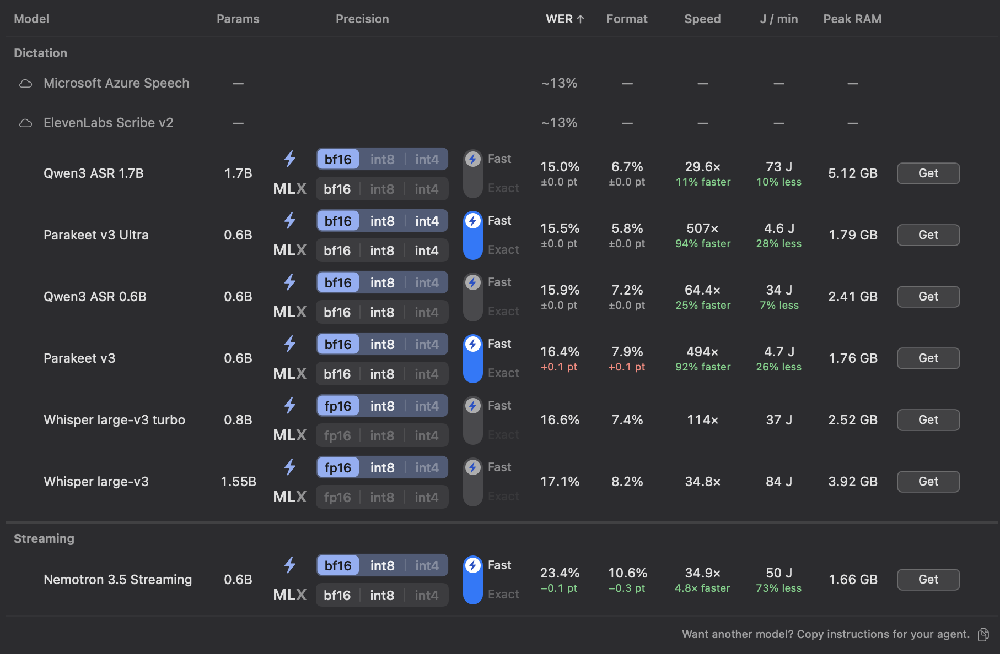
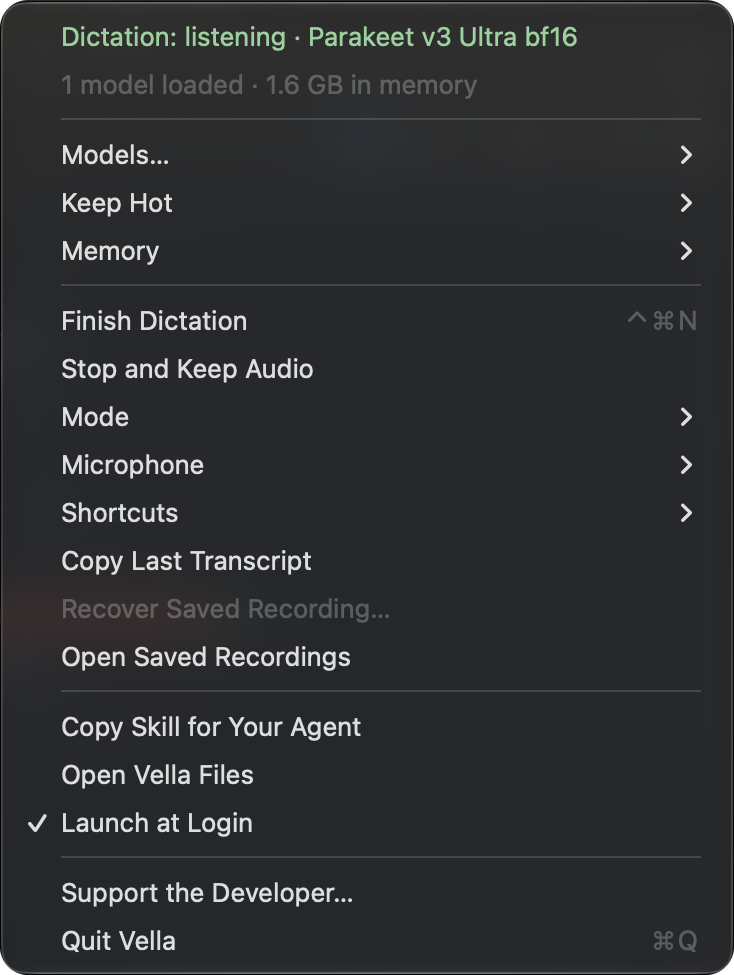

# Vella

<p align="center">
  
</p>

Offline dictation and transcription for Mac: local Whisper, Parakeet and Qwen speech-to-text, tuned for Apple Silicon. Scripts and coding agents get an OpenAI-compatible local API: `POST /v1/audio/transcriptions`.

Press **Control + Command + N**, speak, press it again: Vella transcribes on your Mac and pastes the text where you were typing. In Streaming mode the words appear as you speak. Audio and text stay on the Mac.

```sh
curl -fsSL https://tobynoskillson.github.io/Vella/install.sh | bash
```

Apple Silicon, macOS 26 or newer. No Xcode, Python or developer account.

[Models](#models) · [Install](#install) · [Using it](#using-it) · [For your agent](#for-your-agent) · [Privacy](#privacy) · [User guide](docs/USAGE.md) · [Sponsor](https://github.com/sponsors/TobyNoSkillSon)

## Models

Seven open models; nothing downloads until you choose **Get**. Four starting points:

<!-- RELEASE_SHORT_TABLE_START -->

Measured 1–2 October 2026; Whisper refreshed 2026-10-03 on Apple M5 Max, macOS 26.6. English WER on the 167 English minutes of v2 (239.7 min total); nine other languages scored separately. Speed, energy and peak RAM: v2-quick (22.5 min).

| Model | Use it for | Tier / path | English WER % | Speed | J / audio min | Peak RAM MB |
|---|---|---|---|---|---|---|
| Parakeet v3 Ultra | Dictation in 25 European languages | bf16 · Optimized Fast | 15.51 | 507.1× | 4.58 | 1792 |
| Whisper large-v3 turbo | About 100 languages, faster Whisper | fp16 · Optimized Fast | 16.57 | 115.7× | 36.56 | 2516 |
| Whisper large-v3 | About 100 languages | fp16 · Optimized Fast | 17.06 | 34.9× | 82.41 | 3916 |
| Qwen3 ASR 1.7B | 30 languages, including Chinese, Japanese and Korean | bf16 · Optimized Fast | 15.00 | 29.6× | 72.73 | 5118 |

<!-- RELEASE_SHORT_TABLE_END -->

Standard is optimized for your Mac through MLX; Optimized adds our custom kernels. Measurements are from an M5 Max with a 40-core GPU; other M5 configurations have not yet been tested.

Parakeet v3 Ultra is Moondream's post-training of NVIDIA Parakeet v3 (CC BY 4.0), converted to MLX by `selcukkubur/parakeet-ultra-mlx`. Publishers, source models, MLX converters and licences for every model are in [THIRD_PARTY_NOTICES.md](THIRD_PARTY_NOTICES.md#model-weights-downloaded-not-included).

Each model downloads one pinned checkpoint at its published 16-bit precision, except Parakeet v3, whose pinned source is FP32 (2.51 GB) and which Vella converts once to BF16 when you choose **Get**. `int8` and `int4` are made on your Mac from the 16-bit weights; the download prompt names the exact size first. The table shows the dtype actually running (`bf16`/`fp16`, `int8`, `int4`). Choose Standard or Optimized; Optimized has Exact and Fast recipes. Missing figures show `—`, never a sibling model's score. Models and weights retain their own licences in [`Resources/models.json`](Resources/models.json).

<details>
<summary>Every model and precision: word error rate, speed, energy, Peak RAM</summary>

<!-- BENCHMARK_TABLE_START -->

Measured 2026-10-01, 2026-10-03 on Apple M5 Max, macOS 26.6. English WER on the 167 English minutes of v2 (239.7 min total); nine other languages scored separately; speed, energy and peak RAM: v2-quick (22.5 min). Languages are supported benchmark languages, out of 9.

**Standard** is plain MLX; **Optimized** adds custom kernels. Whisper Standard runs faithful fp16. Whisper Exact and Fast share the same exact-only whisper-4 recipe and canonical measurement. Whisper Standard and Optimized were measured together on the faithful build; their per-cell and tier gates use that build’s fp16 Standard baseline. Other families retain their dated release measurements.

| Model | Mode | Precision | Path | English WER % | Format % | Languages | Speed | J / min | Peak RAM | Suite |
|---|---|---|---|---|---|---|---|---|---|---|
| Parakeet v3 Ultra | Dictation | bf16 | Standard | 15.46 | 5.80 | 5/9 | 261.4× | 6.33 | 1,796 MB | v2 |
| Parakeet v3 Ultra | Dictation | bf16 | Optimized · Exact | 15.49 | 5.74 | 5/9 | 474.5× | 4.71 | 1,808 MB | v2 |
| Parakeet v3 Ultra | Dictation | bf16 | Optimized · Fast | 15.51 | 5.79 | 5/9 | 507.1× | 4.58 | 1,792 MB | v2 |
| Parakeet v3 Ultra | Dictation | int8 | Standard | 15.46 | 5.76 | 5/9 | 244.8× | 8.99 | 1,280 MB | v2 |
| Parakeet v3 Ultra | Dictation | int8 | Optimized · Exact | 15.46 | 5.77 | 5/9 | 369.0× | 8.62 | 1,888 MB | v2 |
| Parakeet v3 Ultra | Dictation | int8 | Optimized · Fast | 15.46 | 5.81 | 5/9 | 515.0× | 5.35 | 1,352 MB | v2 |
| Parakeet v3 Ultra | Dictation | int4 | Standard | 15.62 | 5.81 | 5/9 | 246.7× | 8.75 | 1,024 MB | v2 |
| Parakeet v3 Ultra | Dictation | int4 | Optimized · Exact | 15.65 | 5.84 | 5/9 | 370.6× | 8.41 | 1,640 MB | v2 |
| Parakeet v3 Ultra | Dictation | int4 | Optimized · Fast | 15.58 | 5.80 | 5/9 | 522.5× | 5.13 | 1,094 MB | v2 |
| Parakeet v3 | Dictation | bf16 | Standard | 16.37 | 7.84 | 5/9 | 257.7× | 6.35 | 1,794 MB | v2 |
| Parakeet v3 | Dictation | bf16 | Optimized · Exact | 16.42 | 7.92 | 5/9 | 463.9× | 4.81 | 1,777 MB | v2 |
| Parakeet v3 | Dictation | bf16 | Optimized · Fast | 16.42 | 7.92 | 5/9 | 494.3× | 4.70 | 1,765 MB | v2 |
| Parakeet v3 | Dictation | int8 | Standard | 16.40 | 7.92 | 5/9 | 241.2× | 9.05 | 1,279 MB | v2 |
| Parakeet v3 | Dictation | int8 | Optimized · Exact | 16.35 | 7.81 | 5/9 | 363.3× | 8.68 | 1,883 MB | v2 |
| Parakeet v3 | Dictation | int8 | Optimized · Fast | 16.30 | 7.85 | 5/9 | 504.4× | 5.41 | 1,342 MB | v2 |
| Qwen3 ASR 1.7B | Dictation | bf16 | Standard | 15.00 | 6.67 | 9/9 | 26.6× | 81.03 | 4,624 MB | v2 |
| Qwen3 ASR 1.7B | Dictation | bf16 | Optimized (Exact = Fast) | 15.00 | 6.67 | 9/9 | 29.6× | 72.73 | 5,118 MB | v2 |
| Qwen3 ASR 0.6B | Dictation | bf16 | Standard | 15.89 | 7.16 | 9/9 | 51.7× | 36.82 | 2,142 MB | v2 |
| Qwen3 ASR 0.6B | Dictation | bf16 | Optimized (Exact = Fast) | 15.89 | 7.16 | 9/9 | 64.4× | 34.07 | 2,406 MB | v2 |
| Qwen3 ASR 0.6B | Dictation | int8 | Standard | 16.04 | 7.17 | 9/9 | 60.7× | 33.58 | 1,639 MB | v2 |
| Qwen3 ASR 0.6B | Dictation | int8 | Optimized (Exact = Fast) | 16.04 | 7.17 | 9/9 | 82.0× | 30.05 | 1,920 MB | v2 |
| Whisper large-v3 | Dictation | fp16 | Standard | 17.06 | 8.17 | 9/9 | 29.5× | 86.34 | 3,923 MB | v2 |
| Whisper large-v3 | Dictation | fp16 | Optimized (Exact = Fast) | 17.06 | 8.17 | 9/9 | 34.9× | 82.41 | 3,916 MB | v2 |
| Whisper large-v3 | Dictation | int8 | Standard | 17.27 | 8.18 | 9/9 | 34.0× | 80.65 | 3,141 MB | v2 |
| Whisper large-v3 | Dictation | int8 | Optimized (Exact = Fast) | 17.27 | 8.18 | 9/9 | 43.5× | 73.70 | 3,116 MB | v2 |
| Whisper large-v3 turbo | Dictation | fp16 | Standard | 16.57 | 7.43 | 9/9 | 83.9× | 38.22 | 2,499 MB | v2 |
| Whisper large-v3 turbo | Dictation | fp16 | Optimized (Exact = Fast) | 16.57 | 7.43 | 9/9 | 115.7× | 36.56 | 2,516 MB | v2 |
| Whisper large-v3 turbo | Dictation | int8 | Standard | 16.52 | 7.46 | 9/9 | 91.5× | 37.06 | 2,419 MB | v2 |
| Whisper large-v3 turbo | Dictation | int8 | Optimized (Exact = Fast) | 16.52 | 7.46 | 9/9 | 129.8× | 34.64 | 2,363 MB | v2 |
| Nemotron 3.5 Streaming | Streaming | bf16 | Standard | 23.39 | 10.57 | 9/9 | 7.3× | 188.25 | 2,253 MB | v2 |
| Nemotron 3.5 Streaming | Streaming | bf16 | Optimized · Exact | 23.39 | 10.57 | 9/9 | 19.3× | 80.33 | 2,725 MB | v2 |
| Nemotron 3.5 Streaming | Streaming | bf16 | Optimized · Fast | 23.35 | 10.58 | 9/9 | 34.9× | 50.03 | 1,655 MB | v2 |
| Nemotron 3.5 Streaming | Streaming | int8 | Standard | 23.42 | 10.54 | 9/9 | 15.1× | 112.00 | 1,191 MB | v2 |
| Nemotron 3.5 Streaming | Streaming | int8 | Optimized · Exact | 23.42 | 10.54 | 9/9 | 29.8× | 58.71 | 1,251 MB | v2 |
| Nemotron 3.5 Streaming | Streaming | int8 | Optimized · Fast | 23.44 | 10.55 | 9/9 | 38.4× | 43.07 | 1,114 MB | v2 |
| ElevenLabs Scribe v2 (cloud API) | Dictation | — | — | ~13.4 (estimated, 11.8–13.9) | — | — | — | — | — | estimated |
| Microsoft Azure Speech (cloud API) | Dictation | — | — | ~12.9 (estimated, 11.3–13.3) | — | — | — | — | — | estimated |

Not offered: Parakeet v3 4 (3 clips empty or cut short where 16 had the words); Qwen3 ASR 1.7B 8 (1 clip empty or cut short where 16 had the words; Turkish +42.64 pt vs 16 (presence limit +10.0)); Qwen3 ASR 1.7B 4 (1 clip empty or cut short where 16 had the words); Qwen3 ASR 0.6B 4 (2 clips empty or cut short where 16 had the words); Whisper large-v3 4 (2 clips empty or cut short where 16 had the words); Whisper large-v3 turbo 4 (1 clip empty or cut short where 16 had the words); Nemotron 3.5 Streaming 4 (21 clips empty or cut short where 16 had the words; Chinese +10.70 pt vs 16 (absent from +10.0); Chinese +10.99 pt vs 16 (absent from +10.0); English WER +9.40 pt vs 16 (absent from +5.0); English WER +9.41 pt vs 16 (absent from +5.0); Japanese +10.34 pt vs 16 (absent from +10.0); Japanese +10.46 pt vs 16 (absent from +10.0); Polish +13.15 pt vs 16 (absent from +10.0); Swedish +13.33 pt vs 16 (absent from +10.0); Turkish +12.29 pt vs 16 (absent from +10.0); multilingual mean +8.88 pt vs 16 (absent from +5.0); multilingual mean +8.89 pt vs 16 (absent from +5.0)).

Cloud rows are estimates, not measurements; no audio was sent to them. They retain their dated 26 Sep scaling anchors, not final-build model measurements. Sources, ranges and arithmetic are in `references` in [`Resources/benchmarks.json`](Resources/benchmarks.json).

Build provenance (3 October 2026): measured build `53d1bf3`, built from `932136f`, worker SHA-256 `8a215e827e5972ef9afb4db7cf57ea8f068006f40ef1510ccd66e6977546b99d`, tag `full-8a215e827e59`. Shipped source trees: Worker `d268d239a920e4e6910d101eff0bcf2a06413c70`, Packages `6851d8c101f507aea8980af93fd877aa0e84a20c` (commit `843a43444659dbd7f2de507b1e2da11453efb31b` is informational). The earlier Worker documentation delta from measured defaults was `Worker/Sources/MLXAudioSTT/NemotronASR/README.md`, `Worker/Sources/MLXAudioSTT/Parakeet/README.md`, `Worker/Sources/MLXAudioSTT/Qwen3ASR/README.md`, `Worker/Sources/MLXAudioSTT/Whisper/README.md`, all excluded from the package. A subsequent chip-safety delta adds the macOS 26.2 tensor preflight, GPU architecture/name in gate keys and verdict metadata, Parakeet availability guards, and CPU regression tests. Kernels, tile plans and deadlines are unchanged; old verdicts requalify once per model/recipe. The measured-defaults bridge in the linked JSON predates this safety delta. Pinned build-script SHA-256 `494137a7f64e14c4a621618ab8fd2fd68cdb370ab82bdad16d60ac78f75ee48e`; CI artifact worker SHA-256 (filled at publish, never from a local candidate): pending. The [`Resources/benchmarks.json`](Resources/benchmarks.json) `builds` block records measured and shipped identities and the scoped bridge. Kept levers are on by default: Exact runs exact-only components, Fast runs all kept components, Standard runs none. Whisper Fast passed the recorded token-identity check (six cells, each 122/122 public clips). 4 Oct: build.sh identity, existing-signature and runtime-symbol probes drain producer output under pipefail; failed signature/symbol inspection now refuses the build. The measured build used the old build.sh text. Compilation is unchanged: compiler, flags, build commands, workers and shader inputs are unchanged. Earlier shipped build-script pins were 1862cec695156417ab3518e58b95ab61f491f8c59e867c4709ee68c9024dfc90 (before pipefail repair) and 025547b32840d30e6b1065dcd8322640a0bdcf9d6f972d5c09bfd5b47b76b56b (before producer-error hardening). Faithful Whisper refresh: source `7ccd67c790bb52ec15c344474ee0dc6872e7d0a4`, worker SHA-256 `b49faa52236c39ab210c3a11d993b396517b8483a1859953acccdd7af68bf119`; Standard and shared Exact/Fast measured in the same window.

Nemotron streaming gates: layout_artifact. Every gated cell compares with native Standard using identical session/shard order and endpoint gap. Standard accuracy uses the same-layout control when present; speed and energy retain their dated measurements. Missing same-layout Standard means not gated, not a pass or fail.

Commit SHAs are those of the published history (rewritten 3 Oct to remove the withdrawn comparison); the measured build’s source tree is identical.

<!-- BENCHMARK_TABLE_END -->

- **Precision** is the running weight format: bf16 or fp16 for the 16-bit checkpoint, and int8 or int4 for affine quantization made on your Mac. Parakeet v3’s fp32 download is converted once to bf16 at Get. **Standard** and **Optimized** are the two ways to run a precision; **Exact** and **Fast** are Optimized's two recipes.
- **WER** is English word error rate on the 167 English minutes of the 239.7-minute v2 suite: the percentage of words wrong (substituted, missed or added) out of the words spoken, ignoring case and punctuation. The nine other languages are scored separately and never pooled into this figure. It is the industry-standard metric, as on the Hugging Face Open ASR Leaderboard; our v2 set is hard (meetings, far-field microphones, accents, earnings calls), so rates run higher than on public leaderboards. **Format** is our own measure, with no industry standard: character error rate with case and punctuation kept, i.e. how much editing the finished text needs. Lower is better for both. Multilingual word error rates, per language, are in the WER tooltip.
- **Speed** is the real-time factor (RTFx): audio seconds per processing second, after the model is loaded; 100× means a minute of audio in 0.6 s. **J / min** is the energy the whole chip (CPU, GPU, Neural Engine and memory) used per minute of audio, idle power subtracted. **Peak RAM** is the peak footprint of the model worker, including loading.
Speed differences use “N× faster” at a ratio of 2× or above and “N% faster” below; decreases use “N% slower”. Energy differences always use percentages (“N% less” or “N% more”). Noise-level WER/Format differences read same.

- **Which tiers are offered.** A tier is offered unless it breaks against 16: a clip it leaves empty or cuts short, a request error, English or average word error rate 5 points worse, or one language 10 points worse. A tier that is merely worse is offered with its loss in the figures and the tooltip; Vella's quality gate (English word error rate within 0.1 points of 16, up to 0.2 points for a model whose measured run-to-run noise is larger, the other languages within a similar limit, no dropped or cut-off segments) says whether a tier loses nothing measurable. No tier is recommended: you choose.
- Measurements are from an M5 Max with a 40-core GPU; other M5 configurations have not yet been tested. Other Apple Silicon chips run the fallback paths qualified by self-test. Only M5 Max with 40 GPU cores matches the measured configuration. On every other Mac (including M5, M5 Pro and other M5 Max core counts), Speed stays the **M5 Max measurement**, lighter grey with a small **M5 Max** label; it is not an estimate for that Mac. J / min is `not known`. WER, Format and Peak RAM stay as measured. Tooltip: “Measured on an M5 Max (40-core GPU). Your Mac will differ; vella diagnose measures it.”

Every figure is in [`Resources/benchmarks.json`](Resources/benchmarks.json); the [benchmark methods](docs/BENCHMARKS.md) cover suites, scoring, timing, energy and build provenance. A sortable table is at https://tobynoskillson.github.io/Vella/.

</details>

## Install

```sh
curl -fsSL https://tobynoskillson.github.io/Vella/install.sh | bash
```

Or from a checkout: `git clone https://github.com/TobyNoSkillSon/Vella && cd Vella && scripts/install.sh`. Either way the installer downloads the prebuilt app for this version with curl, checks its SHA-256 and code signature, clears quarantine, installs it in `~/Applications`, starts it and ends with `ready: …`. Coding agents can follow [AGENTS.md](AGENTS.md).

**Optional DMG.** The release also carries a disk image, `Vella-2.0.0.dmg`, wrapped from the same release ZIP; the ZIP remains the primary asset. Open the image and drag Vella to Applications. For Terminal and agents, use `/Applications/Vella.app/Contents/Helpers/vella`, or use the command-line installer, which links `vella`. The app is self-signed and not notarized: after macOS blocks its first launch, use **System Settings → Privacy & Security → Open Anyway**, then confirm. The command-line installer above needs no Gatekeeper step.

Open Vella from the menu bar, approve Microphone and Accessibility access, and press **Control + Command + N**. The first dictation without a model keeps the recording and offers **Get <model> (<size>)**; after the download it transcribes the waiting recording.

<details>
<summary>Updating, verification and uninstalling</summary>

**Updating.** `git pull && scripts/install.sh`. Models, recordings and settings are kept. The installer refuses while Vella is recording, transcribing or loading a model ("try again in a moment"); otherwise it quits Vella, swaps the app in place and restarts it. The previous app is kept until the new one reports ready, and restored if the swap fails. By default, a certificate-signed installation is replaced only by the same signing identity, preserving macOS privacy permissions. Explicit `--migrate-signing` consent permits a change only to Vella’s pinned release signature; permissions must be re-granted and the old app stays available for rollback.

The installer refuses an older version or an older build of the same version. To intentionally downgrade, repeat the original command (including any custom destination) with `--allow-downgrade`. This does not bypass signing checks. Manual rollback restores the saved app directly, without running the installer.

### Upgrading from 0.8

**From 0.8.x.** The old **Update available** item only opens the GitHub release page. For a self-built installation (ad-hoc, Apple Development or another signing identity), update with `scripts/install.sh --migrate-signing` from a current checkout, or use the public installer with `bash -s -- --migrate-signing`. With terminal stdin, confirm the signing change with y/N, even if stderr is redirected. With piped or noninteractive stdin, --migrate-signing itself is explicit consent; the installer prints that authorization before proceeding. Settings, history, recordings and models are kept; macOS will ask for Microphone and Accessibility access again. The installer keeps the old app and prints its rollback path, including after a successful update. Manual ZIP/DMG replacement also keeps Application Support data, but browser downloads may require Privacy & Security → Open Anyway and the manual route does not create a rollback backup. See the 2.0.0 release notes for the full steps and model-selection migration.

A self-built 0.8.x or development-signed app may have an ad-hoc, Apple Development or other signature instead of Vella’s pinned release signature. The installer refuses that identity change by default. Opt in with the flag below. With terminal stdin the installer also explains the change and asks **y/N**, regardless of where stderr goes. With non-terminal stdin, the flag itself explicitly consents and the installer prints that authorization:

```sh
scripts/install.sh --migrate-signing
```

For the public installer: `curl -fsSL https://tobynoskillson.github.io/Vella/install.sh | bash -s -- --migrate-signing`. This permits any verified installed Vella signing identity → Vella’s pinned release signature, never an arbitrary replacement identity. The installer names the identity being replaced. Same-identity updates need no migration consent. macOS will ask for **Microphone** and **Accessibility** again; re-enable Vella under System Settings → Privacy & Security. Settings, history, recordings and models are kept. The previous app stays at the printed path even after readiness; to roll back, quit Vella and move that app back to the printed destination. No upgrade proceeds while recording, transcribing or loading.

**Verification.** `scripts/install-release.sh <version> --dry-run` downloads and verifies a release without installing it. The SHA-256 detects a corrupted download; it comes from the same release, so it is not a signature. Download releases with the installer, not a browser: a browser adds the quarantine flag, and Gatekeeper then blocks the app.

**Uninstalling.** Turn off Launch at Login in Vella, then quit. Trash the installed app (`~/Applications/Vella.app` for the shell installer, `/Applications/Vella.app` for the DMG). Remove `~/.local/bin/vella` only if it points into that app, and `~/.local/share/vella/app-path` if present. Models, recordings and settings remain in `~/Library/Application Support/Vella`; delete them only if you want them gone. The detailed [uninstall guide](docs/USAGE.md#uninstall) covers Vella’s preferences and caches.

</details>

<details>
<summary>Building from source</summary>

```sh
VELLA_BUILD=source scripts/install.sh    # build this checkout and install it
scripts/build.sh                         # build dist/Vella.app only
scripts/release-check.sh                 # what CI and the release workflow check, run locally
```

A source build needs the Command Line Tools Swift (`xcode-select --install`), full Xcode and its Metal Toolchain (`xcodebuild -downloadComponent MetalToolchain`); the installer checks each and prints the command that fixes a missing one. Swift compiles with the Command Line Tools and the MLX shaders with Xcode's Metal compiler. The app is a Swift menu-bar process (`Sources/Vella`) that supervises the recognition helpers (`Worker/`), one process per loaded model; the app itself downloads the models. `scripts/test-unit.sh` builds and runs the app, core and update tests with the shipping Swift compiler and Xcode’s XCTest host. [CONTRIBUTING.md](CONTRIBUTING.md) has the rest.

`scripts/worker-source-identity.sh` permits content-only changes to the recorded Worker README files: its code pin excludes them, while their paths remain pinned. Separately, `scripts/check-commit-citations.swift --check` requires the full committed Worker tree, including READMEs, to match `WORKER_FULL_TREE`. After committing a Worker README-only change, refresh that declared identity and its published provenance references; the code pin stays unchanged.

</details>

## Using it

| Mode | What happens |
|---|---|
| **Dictation** | Speak, click the field you want the text in, then finish. Vella transcribes and pastes there. If focus changed before insertion, the text goes to the clipboard instead. |
| **Streaming** | Text appears as it is recognized, wherever keyboard focus is. Pause speaking while you move between fields. |

**The recording is kept.** Audio is written to disk as you speak; if transcription fails, or no model is installed yet, the recording waits and can be transcribed or retried later. Vella inserts text and never presses Enter.

**Shortcuts** (below **Microphone**) sets the key chord, a single modifier key or a mouse button, and **Toggle**, **Hold to Talk** or **Tap or Hold**. **Copy Last Transcript** recovers the most recent text; **Open Vella Files** shows saved recordings and transcripts.

**Audio files** go through the same models: `vella transcribe talk.m4a` (add `--srt` for subtitles). Your dictation always goes first.

**Something wrong, or slow on your Mac?** `vella diagnose` in Terminal reports your chip, versions, each loaded model's engine and fallbacks, and a timed run of five built-in clips compared with the reference Mac, and links to a prefilled GitHub issue. It includes nothing you dictated. See [Reporting a problem](docs/USAGE.md#reporting-a-problem).

<details>
<summary>The menu, the Models table, Keep Hot and Memory</summary>

Everything lives in the menu: the status line, then **Models… · Keep Hot · Memory**, then **Start Dictation** with **Mode · Microphone · Shortcuts**, your last transcript and saved recordings, then the agent skill, files and **Launch at Login**.

<p align="center">
  
</p>

**Choose.** In Models…, choose a precision on Standard or Optimized. Fast and Exact select the Optimized recipe; unavailable cells explain why in their tooltip.

**Preview.** Choosing a cell previews its figures. Load, Reload or Get applies it; closing the menu discards the preview.

**Load.** Get asks before downloading. Unload frees memory without deleting weights; the trash button removes weights after confirmation.

**Figures.** Hover for the measurement source and differences from Standard. Other Macs show M5 Max measured speed with an M5 Max label, not their own speed.

**Engine.** Under a loaded model's name, **Optimized Fast · <your chip>** or **Optimized Exact · <your chip>** means Vella's kernels passed a self-test against the stock path on this Mac when the model loaded. **Standard** means the stock MLX path: the same model, slower. If the optimized path fails during a transcription, Vella redoes that transcription on the stock path and keeps the model there until it is reloaded.

**Keep Hot** sets how long an idle model stays loaded, timed per model from its last use:

| | Loaded how | Idle window | Next launch |
|---|---|---|---|
| **Manually loaded** | **Load** or **Reload** in the table | Always (default), 5, 15, 30 or 60 min | Loaded again |
| **Loaded on demand** | A dictation needed a model that was not loaded | 15 min (default), 5, 30, 60 min or Always | Not loaded |

**Memory → Fit in free memory**, the default, checks before each load that the model fits in memory macOS can hand out without swapping. If it does not, Vella unloads idle models to make room (on-demand ones first, least recently used first) or refuses the load and says how much it needs, how much is free and what to do. The check is best effort at load time, not a guarantee. **Allow swap (slower)** skips it.

The [user guide](docs/USAGE.md) covers every menu item, recovery and troubleshooting.

</details>

## For your agent

Install: follow [AGENTS.md](AGENTS.md), then `vella skill --install <skills directory>` writes `transcribe/SKILL.md`. **Copy Skill for Your Agent** in the menu copies the same text.

```sh
vella status                      # Vella 2.0.0 running (pid 29335), parakeet-v3-ultra bf16 · Optimized Fast loaded · dictation model Parakeet v3 Ultra (bf16, Optimized Fast) · API http://127.0.0.1:63080/v1
vella transcribe talk.m4a         # the transcript as plain text
vella transcribe talk.m4a --srt   # SRT subtitles; also --vtt, --json, --verbose-json
vella models --json                # all catalog rows, cells, reasons, source and download size
vella select parakeet-v3-ultra --precision bf16 --path Optimized --mode Fast
vella get parakeet-v3-ultra --yes   # only after consent; downloads then loads
vella unload parakeet-v3-ultra      # free memory, keep downloaded weights
vella url                         # http://127.0.0.1:63080/v1
```

| API | |
|---|---|
| Compatible with | OpenAI audio transcriptions: `POST /v1/audio/transcriptions`, `GET /v1/models` |
| Base URL | `vella url` (127.0.0.1 only; the port changes when Vella restarts) |
| Key | Any; the SDKs require one |
| `model` | `whisper-1` = the user's dictation model, or an id from `/v1/models`; transcription never downloads a model |
| Formats | `text`, `json`, `verbose_json` (timed segments), `srt`, `vtt` |
| Input | wav, mp3, m4a, flac, caf, aiff; up to 3 hours per file |
| Not supported | Translation, speaker labels, word-level timestamps |

```python
from openai import OpenAI
import subprocess
client = OpenAI(base_url=subprocess.check_output(["vella", "url"], text=True).strip(), api_key="local")   # the port changes at every launch
with open("talk.m4a", "rb") as f:
    text = client.audio.transcriptions.create(model="whisper-1", file=f, response_format="text")
```

## Privacy

Your audio and transcripts never leave your Mac. The recognition helpers run in a sandbox that denies all network access. The app's local API listens on 127.0.0.1 only and refuses browser requests. The only network traffic is model downloads from Hugging Face when you choose **Get**, and a check for a newer release at most once a day (at launch when due; failed checks retry about hourly) (an ordinary request to GitHub's releases API, no speech data); an update downloads only when you choose **Update Now**. There is no telemetry and no audio upload. Apps you dictate into, clipboard managers and Universal Clipboard see the text you insert or copy.

[Verdict](https://github.com/TobyNoSkillSon/Verdict) and [Vella](https://github.com/TobyNoSkillSon/Vella) are free, open-source Mac apps that run AI models on your own Apple Silicon chip, for you and your coding agent: Verdict decides, Vella listens. [Sponsor them on GitHub](https://github.com/sponsors/TobyNoSkillSon).

## Licence

Vella 2.0 is [MIT-licensed](LICENSE). Published 0.x releases remain Apache-2.0; this does not change their licence retroactively. Keep the copyright and permission notice in [LICENSE](LICENSE), and the applicable [third-party notices](THIRD_PARTY_NOTICES.md), when you redistribute. Vella ships no model weights; each model's licence is in its tooltip in the app and in [`Resources/models.json`](Resources/models.json). The helpers include code adapted from mlx-audio-swift, mlx-audio and mlx-whisper (MIT) and link MLX and swift-transformers; [THIRD_PARTY_NOTICES.md](THIRD_PARTY_NOTICES.md) has each licence, and Vella.app carries it with LICENSE and NOTICE in `Contents/Resources`.

