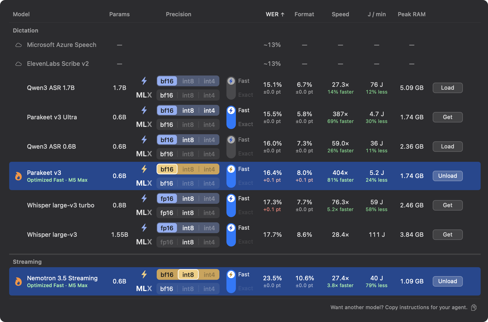
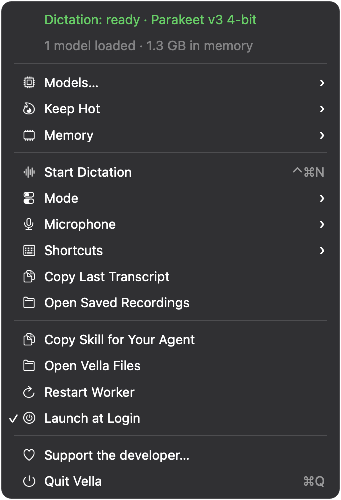

# Vella

Offline dictation and transcription for Mac: local Whisper, Parakeet and Qwen speech-to-text, tuned for Apple Silicon. Scripts and coding agents get an OpenAI-compatible local API: `POST /v1/audio/transcriptions`.

Press **Control + Command + N**, speak, press it again: Vella transcribes on your Mac and pastes the text where you were typing. In Streaming mode the words appear as you speak. Audio and text stay on the Mac.

**A minute of speech in 0.16 s, 5.2 J** (Parakeet v3 Ultra, loaded, Apple M5 Max, 2026-09-28; every model's figures [below](#models)).

```sh
curl -fsSL https://tobynoskillson.github.io/Vella/install.sh | bash
```

Apple Silicon, macOS 14 or newer. No Xcode, Python or developer account.

[Models](#models) · [Install](#install) · [Using it](#using-it) · [For your agent](#for-your-agent) · [Privacy](#privacy) · [User guide](docs/USAGE.md) · [Sponsor](https://github.com/sponsors/TobyNoSkillSon)

<p align="center">
  
</p>

## Models

Seven open models, each for a purpose the others do not serve. Vella downloads none until you choose one.

| Model | Use it for | Licence |
|---|---|---|
| Parakeet v3 Ultra | Dictation in 25 European languages, post-trained for dictation | CC BY 4.0 |
| Parakeet v3 | The same languages: the unmodified NVIDIA original | CC BY 4.0 |
| Qwen3 ASR 1.7B | 30 languages, including Chinese, Japanese and Korean | Apache-2.0 |
| Qwen3 ASR 0.6B | The same 30 languages in less memory | Apache-2.0 |
| Whisper large-v3 | About 100 languages | Apache-2.0 |
| Whisper large-v3 turbo | The same languages, faster | MIT |
| Nemotron 3.5 Streaming | Streaming mode: typing while you speak | OpenMDW-1.1 (MLX conversion: NVIDIA Open Model License) |

Parakeet transcribes at about 365× real time, Qwen3 ASR 1.7B and Whisper large-v3 at about 28× (Apple M5 Max, 2026-09-28). Each model runs at 32, 16, 8 and 4 bits per weight, as far down from its native precision as it goes; precisions the authors do not publish are made on your Mac from the higher one. Every accuracy, speed, energy and memory figure comes from a dated benchmark run; anything not measured shows `—`.

<details>
<summary>Every model and precision: word error rate, speed, energy, memory</summary>

<!-- BENCHMARK_TABLE_START -->

Measured on Apple M5 Max, macOS 26.6, 2026-09-28. WER and Format on the 240-minute v2 benchmark (`v2`) or its 22.5-minute quick subset (`v2-quick`); Languages = benchmark languages supported, of 9.

Each recommended row has a **Stock MLX (any Mac)** baseline row under it: the same model and precision with every Vella optimization off (plain MLX), which is what any Apple-silicon Mac runs when its load-time self-test does not qualify the fast path. Same suites, same session.

| Model | Mode | Q | WER % | Format % | Languages | Speed | J / min | Memory | Suite |
|---|---|---|---|---|---|---|---|---|---|
| Parakeet v3 Ultra | Dictation | 16 (recommended) | 15.54 | 5.80 | 5/9 | 387× | 4.7 | 1,740 MB | v2 |
| ↳ Stock MLX (any Mac) | Dictation | 16 | 15.50 | 5.82 | 5/9 | 229× | 6.7 | 1,732 MB | v2 |
| Parakeet v3 Ultra | Dictation | 8 | 15.54 | 5.69 | 5/9 | 284× | 9.6 | 1,862 MB | v2 |
| Parakeet v3 Ultra | Dictation | 4 | 15.78 | 5.94 | 5/9 | 282× | 9.4 | 1,610 MB | v2 |
| Parakeet v3 | Dictation | 32 | 16.43 | 7.97 | 5/9 | 302× | 7.1 | 3,231 MB | v2 |
| Parakeet v3 | Dictation | 16 (recommended) | 16.45 | 7.98 | 5/9 | 404× | 5.2 | 1,735 MB | v2 |
| ↳ Stock MLX (any Mac) | Dictation | 16 | 16.39 | 7.90 | 5/9 | 223× | 6.9 | 1,735 MB | v2 |
| Parakeet v3 | Dictation | 8 | 16.55 | 8.05 | 5/9 | 278× | 9.8 | 1,758 MB | v2 |
| Parakeet v3 | Dictation | 4 | 17.84 | 9.24 | 5/9 | 277× | 9.6 | 1,520 MB | v2 |
| Qwen3 ASR 1.7B | Dictation | 16 (recommended) | 15.06 | 6.74 | 9/9 | 27× | 75.6 | 5,092 MB | v2 |
| ↳ Stock MLX (any Mac) | Dictation | 16 | 15.06 | 6.74 | 9/9 | 24× | 85.6 | 4,600 MB | v2 |
| Qwen3 ASR 1.7B | Dictation | 8 | 15.16 | 6.65 | 9/9 | 41× | 68.1 | 3,689 MB | v2 |
| Qwen3 ASR 1.7B | Dictation | 4 | 18.41 | 7.19 | 9/9 | 56× | 55.9 | 2,867 MB | v2 |
| Qwen3 ASR 0.6B | Dictation | 16 (recommended) | 15.97 | 7.29 | 9/9 | 59× | 35.9 | 2,364 MB | v2 |
| ↳ Stock MLX (any Mac) | Dictation | 16 | 15.97 | 7.29 | 9/9 | 47× | 40.2 | 2,086 MB | v2 |
| Qwen3 ASR 0.6B | Dictation | 8 | 16.14 | 7.29 | 9/9 | 76× | 33.1 | 1,887 MB | v2 |
| Qwen3 ASR 0.6B | Dictation | 4 | 17.72 | 8.43 | 9/9 | 89× | 28.1 | 1,619 MB | v2 |
| Whisper large-v3 | Dictation | FP16 | 17.68 | 8.63 | 9/9 | 28× | 110.9 | 3,838 MB | v2 |
| Whisper large-v3 | Dictation | 8 (recommended) | 17.78 | 8.60 | 9/9 | 33× | 109.9 | 2,653 MB | v2 |
| ↳ Stock MLX (any Mac) | Dictation | 8 | 17.64 | 8.59 | 9/9 | 17× | 171.2 | 2,832 MB | v2 |
| Whisper large-v3 | Dictation | 4 | 17.75 | 8.82 | 9/9 | 41× | 97.9 | 2,081 MB | v2 |
| Whisper large-v3 turbo | Dictation | FP16 (recommended) | 17.31 | 7.69 | 9/9 | 76× | 59.2 | 2,460 MB | v2 |
| ↳ Stock MLX (any Mac) | Dictation | FP16 | 17.20 | 7.67 | 9/9 | 15× | 140.0 | 3,346 MB | v2 |
| Whisper large-v3 turbo | Dictation | 8 | 17.21 | 7.70 | 9/9 | 78× | 64.5 | 1,925 MB | v2 |
| Whisper large-v3 turbo | Dictation | 4 | 17.80 | 8.43 | 9/9 | 82× | 63.1 | 1,688 MB | v2 |
| Nemotron 3.5 Streaming | Streaming | 16 (recommended) | 23.39 | 10.55 | 9/9 | 27× | 54.4 | 1,614 MB | v2 |
| ↳ Stock MLX (any Mac) ¹ | Streaming | 16 | 23.15 | 10.47 | 9/9 | 7× | 189.3 | 2,081 MB | v2 |
| Nemotron 3.5 Streaming | Streaming | 8 | 23.47 | 10.58 | 9/9 | 27× | 40.1 | 1,088 MB | v2 |
| Nemotron 3.5 Streaming | Streaming | 4 | 32.97 | 16.19 | 9/9 | 30× | 39.6 | 821 MB | v2 |
| ElevenLabs Scribe v2 (cloud API) | Dictation | — | ~13.4 (estimated, 11.8–13.9) | — | — | — | — | — | estimated |
| Microsoft Azure Speech (cloud API) | Dictation | — | ~12.9 (estimated, 11.3–13.3) | — | — | — | — | — | estimated |

¹ Nemotron 3.5 Streaming: Stock measured with different sharding (5-way vs 2-way; in streaming each clip depends on its neighbours); rerun pending.

Cloud API rows are **estimates, not measurements**: we sent no audio to them. Each is the provider's WER on the Hugging Face Open ASR Leaderboard times the median ratio between our v2 WER and the leaderboard WER of the models we measured on both (Parakeet v3, Qwen3 ASR 1.7B, Nemotron 3.5 Streaming); the range uses the lowest and highest ratio. Leaderboard: https://huggingface.co/spaces/hf-audio/open_asr_leaderboard. Sources, anchors and arithmetic are in `references` in [`Resources/benchmarks.json`](Resources/benchmarks.json).

Measured but not offered in the app:

| Model | Mode | Q | WER % | Format % | Languages | Speed | J / min | Memory | Suite |
|---|---|---|---|---|---|---|---|---|---|
| Parakeet TDT-CTC 110M | Dictation | 32 (recommended) | 9.25 | 6.01 | 0/9 | 222× | 5.0 | 889 MB | v2-quick |
| SenseVoice Small | Dictation | 32 (recommended) | 11.01 | 7.77 | 3/9 | 420× | — | 1,548 MB | v2-quick |

<!-- BENCHMARK_TABLE_END -->

- **Q** is bits per weight: 32 is FP32, 16 is BF16, 8 and 4 are quantized. Whisper's native FP16 shows as FP16.
- **WER** is word error rate: the percentage of words wrong (substituted, missed or added) out of the words spoken, ignoring case and punctuation. It is the industry-standard metric, as on the Hugging Face Open ASR Leaderboard; our v2 set is hard (meetings, far-field microphones, accents, earnings calls), so rates run higher than on public leaderboards. **Format** is our own measure, with no industry standard: character error rate with case and punctuation kept, i.e. how much editing the finished text needs. Lower is better for both. Multilingual word error rates, per language, are in the WER tooltip.
- **Speed** is the real-time factor (RTFx): audio seconds per processing second, after the model is loaded; 100× means a minute of audio in 0.6 s. **J / min** is the energy the whole chip (CPU, GPU, Neural Engine and memory) used per minute of audio, idle power subtracted. **Memory** is the loaded model's footprint.
- **Recommended precision.** A model shows its recommended precision until it has been loaded at another: among its native precision and the precisions that pass Vella's quality gate against it, the one with the lowest energy per minute of audio (ties: faster, then more bits). The gate: English word error rate within 0.1 points of the native precision's (up to 0.2 points for a model whose measured run-to-run noise is larger), the average over the other languages within a similar noise-based limit, no language clearly worse, and no dropped or cut-off segments. A live streaming model's precision can also pass by being clearly faster with English within the limit.
- Figures were measured on an Apple M5 Max. On other Macs, speed, energy and memory differ; accuracy does not. The table says so on other chips.

Every figure is in [`Resources/benchmarks.json`](Resources/benchmarks.json); a sortable table is at https://tobynoskillson.github.io/Vella/.

</details>

## Install

```sh
curl -fsSL https://tobynoskillson.github.io/Vella/install.sh | bash
```

Or from a checkout: `git clone https://github.com/TobyNoSkillSon/Vella && cd Vella && scripts/install.sh`. Either way the installer downloads the prebuilt app for this version with curl, checks its SHA-256 and code signature, installs it in `~/Applications`, starts it and ends with `ready: …`. Coding agents can follow [AGENTS.md](AGENTS.md).

Open Vella from the menu bar, approve Microphone and Accessibility access, and press **Control + Command + N**. The first dictation without a model keeps the recording and offers **Get <model> (<size>)**; after the download it transcribes the waiting recording.

<details>
<summary>Updating, verification and uninstalling</summary>

**Updating.** `git pull && scripts/install.sh`. Models, recordings and settings are kept. The installer refuses while Vella is recording, transcribing or loading a model ("try again in a moment"); otherwise it quits Vella, swaps the app in place and restarts it. The previous app is kept until the new one reports ready, and restored if the swap fails. A certificate-signed installation is only replaced by an app with the same signing identity, so macOS privacy permissions carry over.

**Verification.** `scripts/install-release.sh <version> --dry-run` downloads and verifies a release without installing it. The SHA-256 detects a corrupted download; it comes from the same release, so it is not a signature. Download releases with the installer, not a browser: a browser adds the quarantine flag, and Gatekeeper then blocks the app.

**Uninstalling.** Quit Vella and move `~/Applications/Vella.app` to the Trash. Models, settings and recordings stay in `~/Library/Application Support/Vella`; delete that folder too if you want them gone.

</details>

<details>
<summary>Building from source</summary>

```sh
VELLA_BUILD=source scripts/install.sh    # build this checkout and install it
scripts/build.sh                         # build dist/Vella.app only
scripts/release-check.sh                 # what CI and the release workflow check, run locally
```

A source build needs the Command Line Tools Swift (`xcode-select --install`), full Xcode and its Metal Toolchain (`xcodebuild -downloadComponent MetalToolchain`); the installer checks each and prints the command that fixes a missing one. Swift compiles with the Command Line Tools and the MLX shaders with Xcode's Metal compiler. The app is a Swift menu-bar process (`Sources/Vella`) that supervises the recognition helpers (`Worker/`), one process per loaded model, and `VellaModelTool` for downloads. `xcrun swift test` runs the unit tests. [CONTRIBUTING.md](CONTRIBUTING.md) has the rest.

</details>

## Using it

| Mode | What happens |
|---|---|
| **Dictation** | Speak, click the field you want the text in, then finish. Vella transcribes and pastes there. If focus changed before insertion, the text goes to the clipboard instead. |
| **Streaming** | Text appears as it is recognized, wherever keyboard focus is. Pause speaking while you move between fields. |

**The recording is kept.** Audio is written to disk as you speak; if transcription fails, or no model is installed yet, the recording waits and can be transcribed or retried later. Vella inserts text and never presses Enter.

**Shortcuts** (below **Microphone**) sets the key chord, a single modifier key or a mouse button, and **Toggle**, **Hold to Talk** or **Tap or Hold**. **Copy Last Transcript** recovers the most recent text; **Open Vella Files** shows saved recordings and transcripts.

**Audio files** go through the same models: `vella transcribe talk.m4a` (add `--srt` for subtitles). Your dictation always goes first.

**Something wrong, or slow on your Mac?** **Copy Diagnostics** in the menu (or `vella diagnose`) reports your chip, versions, each loaded model's engine and fallbacks, and a timed run of five built-in clips compared with the reference Mac, and links to a prefilled GitHub issue. It includes nothing you dictated. See [Reporting a problem](docs/USAGE.md#reporting-a-problem).

<details>
<summary>The menu, the Models table, Keep Hot and Memory</summary>

Everything lives in the menu: the status line, then **Models… · Keep Hot · Memory**, then **Start Dictation** with **Mode · Microphone · Shortcuts**, your last transcript and saved recordings, then the agent skill, diagnostics, files, the worker and **Launch at Login**.

<p align="center">
  
</p>

**Models…** opens one table with Dictation and Streaming sections. Pick a precision in a row's **Q** control (32, 16, 8, 4); the recommended one is green, and each segment's tooltip names the exact format and whether it is published or made on your Mac. Rows keep their place when you switch precision: each column sorts by the model's best value across its precisions. A loaded model shows the precision it is loaded at; clicking another segment previews it (its figures against the recommended one) and, on a loaded model, turns the button into a green **Reload**, which loads it; closing the menu discards the preview. The precision last loaded is the one dictation uses. **Get** downloads and loads (for a precision made on your Mac, it downloads the weights it is made from), **Load** keeps a model ready, **Unload** frees its memory, and the trash icon deletes its weights. Every download first asks in a popup that names the model, precision, source and exact size; nothing downloads without **Download**.

**Engine.** Under a loaded model's name, **Optimized · <your chip>** means Vella's optimized kernels passed a self-test against the stock path on this Mac when the model loaded. **MLX** means the stock MLX path: the same model, slower. If the optimized path fails during a transcription, Vella redoes that transcription on the stock path and keeps the model there until it is reloaded.

**Keep Hot** sets how long an idle model stays loaded, timed per model from its last use:

| | Loaded how | Idle window | Next launch |
|---|---|---|---|
| **Manually loaded** | **Load** or **Reload** in the table | Always (default), 5, 15, 30 or 60 min | Loaded again |
| **Loaded on demand** | A dictation needed a model that was not loaded | 15 min (default), 5, 30, 60 min or Always | Not loaded |

**Memory → Fit in free memory**, the default, checks before each load that the model fits in memory macOS can hand out without swapping. If it does not, Vella unloads idle models to make room (on-demand ones first, least recently used first) or refuses the load and says how much it needs, how much is free and what to do. The check is best effort at load time, not a guarantee. **Allow swap (slower)** skips it.

The [user guide](docs/USAGE.md) covers every menu item, recovery and troubleshooting.

</details>

## For your agent

Install: follow [AGENTS.md](AGENTS.md), then `vella skill --install <skills directory>` writes `transcribe/SKILL.md`. **Copy Skill for Your Agent** in the menu copies the same text.

```sh
vella status                      # Vella 1.0.0 running (pid 29335), parakeet-v3-ultra BF16 loaded · dictation model Parakeet v3 Ultra (BF16) · API http://127.0.0.1:63080/v1
vella transcribe talk.m4a         # the transcript as plain text
vella transcribe talk.m4a --srt   # SRT subtitles; also --vtt, --json, --verbose-json
vella models                      # parakeet-v3-ultra  Parakeet v3 Ultra · BF16 · loaded · current dictation model
vella url                         # http://127.0.0.1:63080/v1
```

| API | |
|---|---|
| Compatible with | OpenAI audio transcriptions: `POST /v1/audio/transcriptions`, `GET /v1/models` |
| Base URL | `vella url` (127.0.0.1 only; the port changes when Vella restarts) |
| Key | Any; the SDKs require one |
| `model` | `whisper-1` = the user's dictation model, or an id from `/v1/models`; the API never downloads a model |
| Formats | `text`, `json`, `verbose_json` (timed segments), `srt`, `vtt` |
| Input | wav, mp3, m4a, flac, caf, aiff; up to 3 hours per file |
| Not supported | Translation, speaker labels, word-level timestamps |

```python
from openai import OpenAI
client = OpenAI(base_url="http://127.0.0.1:63080/v1", api_key="local")   # base_url from `vella url`
text = client.audio.transcriptions.create(model="whisper-1", file=open("talk.m4a", "rb"), response_format="text")
```

## Privacy

Audio and transcripts never leave your Mac. The recognition helpers run in a sandbox that denies all network access. The app's local API listens on 127.0.0.1 only and refuses browser requests. The only network traffic is model downloads from Hugging Face when you choose **Get**, and a once-a-day check for a newer release after a transcription (an ordinary GitHub request, no speech data). There is no telemetry. Apps you dictate into, clipboard managers and Universal Clipboard see the text you insert or copy.

[Verdict](https://github.com/TobyNoSkillSon/Verdict), [Vella](https://github.com/TobyNoSkillSon/Vella) and [Vireo](https://github.com/TobyNoSkillSon/Vireo) are free, open-source Mac apps that run AI models on your own Apple Silicon chip, for you and your coding agent: Verdict decides, Vella listens, Vireo speaks. [Sponsor them on GitHub](https://github.com/sponsors/TobyNoSkillSon).

## Licence

[Apache-2.0](LICENSE). Keep the [NOTICE](NOTICE) when you redistribute. Vella ships no model weights; each model's licence is in the [Models](#models) table above, in its tooltip in the app and in [`Resources/models.json`](Resources/models.json). The helpers include code adapted from mlx-audio-swift, mlx-audio and mlx-whisper (MIT) and link MLX and swift-transformers; [THIRD_PARTY_NOTICES.md](THIRD_PARTY_NOTICES.md) has each licence, and Vella.app carries it with LICENSE and NOTICE in `Contents/Resources`.
