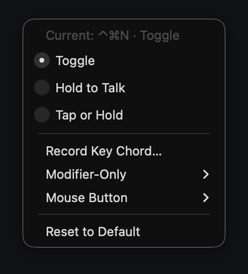
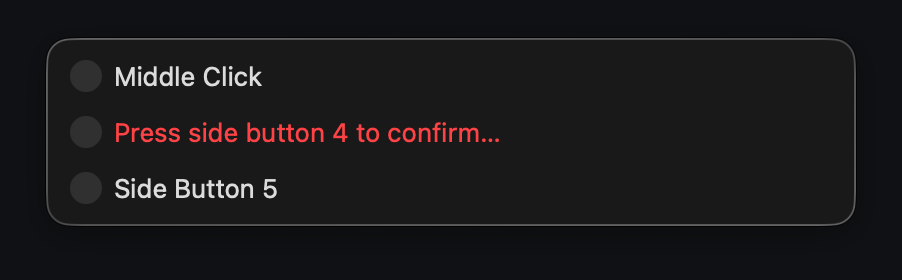

# Vella user guide

[Back to Vella](../README.md)

## Install or update

```sh
git clone https://github.com/TobyNoSkillSon/Vella && cd Vella
scripts/install.sh            # later: git pull && scripts/install.sh
```

Requirements: an Apple Silicon Mac with macOS 26 or newer. The prebuilt app needs no Xcode, Python or developer account.

What `scripts/install.sh` does, in order:

1. Downloads `Vella-<version>-arm64.zip` and `SHA256SUMS` for the version in this checkout with curl (never a browser, which would quarantine the app).
2. Verifies before touching anything: the exact checksum line for the zip, that the archive holds only `Vella.app` with its helpers and Metal library, that the app's version is the one requested, and its code signature. The staged installer clears quarantine before launch. `scripts/install-release.sh <version> --dry-run` stops here.
3. Refuses, leaving everything unchanged, while Vella is recording, transcribing or loading a model.
4. Quits a running Vella, copies the new app beside the old one, verifies it again and swaps it in. If the swap fails the old app is restored. A certificate-signed installation is only replaced by an app with the same signing identity, so macOS privacy permissions carry over.
5. Starts Vella and waits until it is ready: the app has written its status, nothing is loading, and every model you keep loaded at launch is loaded (a fresh install has none). It prints `ready: …`. Only then is the previous app deleted; if Vella is not ready within 30 minutes, or it runs but a model you keep loaded could not load (`degraded: …`), the previous app is kept and its path printed. `VELLA_ACCEPT_DEGRADED=1` makes a degraded install exit 0; the previous app is still kept.

### Upgrading from 0.8

**From 0.8.x.** The old **Update available** item only opens the GitHub release page. For a self-built ad-hoc installation, update with `scripts/install.sh --migrate-signing` from a current checkout, or use the public installer with `bash -s -- --migrate-signing`. With terminal stdin, confirm the signing change with y/N, even if stderr is redirected. With piped or noninteractive stdin, --migrate-signing itself is explicit consent; the installer prints that authorization before proceeding. Settings, history, recordings and models are kept; macOS will ask for Microphone and Accessibility access again. The installer keeps the old app and prints its rollback path, including after a successful update. Manual ZIP/DMG replacement also keeps Application Support data, but browser downloads may require Privacy & Security → Open Anyway and the manual route does not create a rollback backup. See the 2.0.0 release notes for the full steps and model-selection migration.

A self-built 0.8 app has an ad-hoc signature, not Vella’s release signature. The installer refuses that identity change by default. Opt in with the flag below. With terminal stdin the installer also explains the change and asks **y/N**, regardless of where stderr goes. With non-terminal stdin, the flag itself explicitly consents and the installer prints that authorization:

```sh
scripts/install.sh --migrate-signing
```

For the public installer: `curl -fsSL https://tobynoskillson.github.io/Vella/install.sh | bash -s -- --migrate-signing`. This permits only a verified ad-hoc Vella app → Vella’s pinned release signature, never an arbitrary certificate change. macOS will ask for **Microphone** and **Accessibility** again; re-enable Vella under System Settings → Privacy & Security. Settings, history, recordings and models are kept. The previous app stays at the printed path even after readiness; to roll back, quit Vella and move that app back to the printed destination. No upgrade proceeds while recording, transcribing or loading.

The installer also links the `vella` command into `~/.local/bin` (see **Transcribe files** below).

Models, recordings and settings in `~/Library/Application Support/Vella` are kept. The whole app bundle is replaced, so files from older versions never linger inside it. The checksum detects a corrupted download; it comes from the same release, so it is not a signature.

`VELLA_BUILD=source scripts/install.sh` builds this checkout instead (Command Line Tools Swift, full Xcode and its Metal Toolchain; the installer prints the command that fixes a missing one) and installs it the same way.

**Optional DMG.** The release also carries a disk image, `Vella-2.0.0.dmg`, wrapped from the same release ZIP; the ZIP remains the primary asset. Open the image and drag Vella to Applications. For Terminal and agents, use `/Applications/Vella.app/Contents/Helpers/vella`, or use the command-line installer, which links `vella`. The app is self-signed and not notarized: after macOS blocks its first launch, use **System Settings → Privacy & Security → Open Anyway**, then confirm. The command-line installer above needs no Gatekeeper step.

## First run

1. Open Vella and approve Microphone and Accessibility access when asked.
2. Press **Control + Command + N** to record. Click your destination field, then press the shortcut again to finish.

A fresh install has no model. If you dictate before getting one, Vella keeps the recording and the menu shows **Get <model> (<size>)** (the first Dictation model, at 16). Click it and confirm the download (see **Downloads** below): the model downloads from Hugging Face, and the saved recording is transcribed when ready and copied, never pasted automatically. Click your destination and press ⌘V. Nothing downloads without that confirmation. After that, transcription works offline.

## Menu

1. **Status** — names the mode and current state, for example `Dictation: ready` or `Streaming: listening`. Orange means permission is needed or a recording needs attention; click it for the relevant settings or error. **Open Vella Files** opens logs. Tooltips appear only when they add information.
2. **Models…** · **Keep Hot** · **Memory**.
3. **Start Dictation** · **Mode** (Dictation or Streaming) · **Microphone** · **Shortcuts** · **Copy Last Transcript** · **Recover Saved Recording…** · **Open Saved Recordings**.
4. **Copy Skill for Your Agent** · **Open Vella Files** · **Launch at Login**.
5. **Support the Developer…** · **Update to X…** (when a newer release is out) · **Quit Vella**.

Tooltips appear only when they add information.

## Models

**Models…** opens one table with a Dictation section and a Streaming section, divided by a thick line. Each line is one model:

| Column | Meaning |
|---|---|
| Model | Name; under a loaded model, what runs (**Optimized Fast · <chip>**, **Optimized Exact · <chip>** or **Standard**). Tooltip: what it is for and its languages, parameters, native precision, licence. |
| Params | Parameter count. |
| Precision | Two rows of three equal cells, named by the format that runs: **Optimized** (a bolt: Vella's kernels for this chip, same weights) above **Standard** (the MLX logo: plain MLX, same weights, no custom kernels). `bf16` (`fp16` for Whisper) is the checkpoint as released (Parakeet v3's fp32 release is converted once to bf16); `int8` and `int4` are affine 8- and 4-bit (group 64) compressed on this Mac from it: reduced weight size; speed, peak RAM and accuracy depend on the model and path. Every row shows all six cells; a cell that cannot run is greyed in place, never hidden, and its tooltip says why in one line (`Not offered: 1 clip empty or cut short where 16 had the words`, `Not measured yet`, `No Exact recipe at int8; Fast offers it`). Every other cell is clickable and shows its own figures. Each segment's tooltip gives the format and, where Standard is measured, the difference from Standard bf16, e.g. `vs Standard bf16: +2.0× speed · −35 % energy · WER +0.05 · M5 Max, 28 Sep`, and for a precision that is worse than 16 its loss. |
| (switch) | Beside both rows and as tall as the pair, a switch, up **Fast**, down **Exact**; a click anywhere on it flips it. It applies to the Optimized row only (its knob carries that row's bolt): **Exact**: exact-only components that must match Standard on the load-time self-test (full-suite figures can differ slightly), **Fast** also chip-specific kernels within the model's own noise. Greyed and pinned up where Fast measures the same as Exact (always on). Exact offers only the precisions with an exact recipe: flipping to Exact on one without moves the row to 16, and the line under the name says so (`Exact: bf16 only, was int8`). |
| WER | English word error rate on Vella's benchmark (the 167 English minutes of its 239.7-minute v2 suite; the nine other languages are scored separately): the percentage of words wrong (substituted, missed or added) out of the words spoken, ignoring case and punctuation. The industry-standard metric, as on the Hugging Face Open ASR Leaderboard; Vella's v2 set is hard (meetings, far-field microphones, accents, earnings calls), so its rates run higher. Tooltip: word error rate per benchmark language. |
| Format | Vella's own measure of finished text: character error rate with case and punctuation kept. No industry standard exists for it. |
| Speed | Real-time factor (RTFx): audio seconds per processing second, after loading. |
| J / min | Joules per minute of audio, whole chip, idle subtracted. |
| Peak RAM | Peak memory of the model worker including loading and transcription. |
| (last) | The button: **Get**, **Load**, **Unload** or **Reload** (see **Actions**); a pending change shows the green **Reload**. Its tooltip says whether the model is loaded, on disk or not downloaded. |

Lower is better for WER, Format, J / min and Peak RAM; higher for Speed. The small line under WER, Format, Speed and J / min is the difference from measured Standard bf16; a row showing that cell has none. Whisper has no Standard measurement after the FP16 correction, so no comparison delta is shown. While the shipped figures predate the build that ships (`figures_pending` in `benchmarks.json`), every figure and difference shows `—` and the rows keep the catalog order; choosing cells works as usual. `—` means not measured at that precision; Vella never estimates a figure for a local model. The greyed cloud rows in Dictation (ElevenLabs Scribe v2, Microsoft Azure Speech) are for comparison only: Vella never sends audio to them, and their WER (`~13%`) is estimated from the Hugging Face Open ASR Leaderboard, not measured; the tooltip gives the source and range. Clicking a heading sorts by each model's best value across its precisions, so rows keep their place when you switch precision; models with nothing measured come last. Every figure's tooltip says when and on which Mac it was measured; a cell not measured yet shows `—` (measure pending). On a Mac with a different chip family, the footer says `Benchmarks measured on M5 Max`: speed, energy and memory differ on your Mac; transcripts can differ when components fall back.

**Which tiers are offered.** A tier is offered unless it breaks against 16: a clip it leaves empty or cuts short, a request error, English or average word error rate 5 points worse, or one language 10 points worse; then it is absent. A tier that is merely worse is offered, and its tooltip states the loss, e.g. `Loss vs 16: multilingual mean +0.55 pt`. Vella's quality gate decides what counts as a loss: English word error rate within 0.1 points of 16 (up to 0.2 points for a model whose measured run-to-run noise is larger), the average over the other languages within a similar noise-based limit, no language more than 2 points worse, and no dropped or cut-off segments. Nothing is marked as recommended: you choose.

**One state per model.** A loaded model's row always shows the precision it is loaded at, with **Unload**. An unloaded row shows what it was last loaded with, else Optimized 16 · Fast (Standard 16 where the model has no Optimized 16), with **Load** (or **Get** when it is not downloaded). If what it was last loaded with is no longer offered, or has no measurement, the row shows the nearest cell that has (the same tier's Optimized cell, else 16), and that is what dictation and `vella` load too; earlier downloaded quantizations are kept on disk but are not used as the measured local tiers. If their native source is installed, Vella prepares the offered local precision, or falls back to native if the old tier is no longer offered. Otherwise the selection is cleared and Get is required; nothing downloads automatically. Clicking another cell, on either row, or flipping the switch is a preview: the row shows that cell's figures, with the difference from Standard 16 beneath (green better, red worse), and on a loaded model a green **Reload**, which loads it in place of the loaded one. Closing the menu without Reload discards the preview. While the model is recording, transcribing, streaming or loading, its segments and switch are locked; a change applies at the next load. Only Load and Reload change the model: the one last loaded for a mode is the one its next dictation (or streaming session) loads, so the table and dictation always agree.

**Made on this Mac.** Parakeet v3 is converted once from fp32 to bf16 during Get, and bf16 is kept on disk. int8 and int4 are made in memory from the native source at every load; only their recipe is stored. Deleting the native weights removes dependent recipes too; choose another model for that mode first.

**Actions.** The button at the end of each row is always there. **Get** downloads the model and loads it (the download popup gives its size). **Load** loads it and keeps it loaded (see Keep Hot); **Unload** frees its memory and keeps the download. The trash icon that appears beside the button under the pointer deletes the downloaded weights after confirmation. Recordings and transcripts are never deleted with a model.

**Downloads.** Every action that needs a download (Get, Load or Reload of a precision that is not on disk, a precision made on this Mac whose source is missing, the first-dictation Get) first asks in a popup: which model and precision, whether it is published on Hugging Face (repository and revision) or made on this Mac from which weights, the exact download size, the disk space needed and free, and that it loads when done. **Cancel** is the default; nothing downloads without **Download**. The footer shows the progress; a failed or stalled download shows its reason there. A cancelled or failed download removes its partial files, and when Vella starts it deletes partial downloads left in its Models folder by a quit or crash.

Speed differences use N× faster at a ratio of 2× or above and N% faster below; decreases use N% slower. Energy differences always use percentages (N% less or N% more). Noise-level WER/Format differences read same.

**Engine.** **Optimized Fast · <chip>** or **Optimized Exact · <chip>** means Vella's optimized kernels for this model passed a self-test against the stock MLX path on this Mac, in a separate process, when the model loaded; the result is remembered for this model, GPU, macOS version and app version. **Standard** means the stock path: same model, slower. The tooltip lists which parts are optimized. Qwen3-ASR's optimized path computes its audio encoder in FP32 like the stock path and must match it token for token. Kernels that only reorder sums (not bit-identical by construction) are tested within a tolerance instead: for Parakeet, its matrix-unit GEMMs on M5-generation GPUs (`nax_gemm`) and its native int8 and int4 encoder GEMMs (`int8_gemm`, `int4_gemm`), each needing finite output, a bound on how far its result may move, and at most one word changed over the five test clips; for Nemotron, the fused conformer layer (with its BF16 linears) and the batched joint, checked for the same streamed text within a small numeric tolerance. Parakeet can disable an individual inexact component after a failed self-test. A failed Nemotron self-test runs the whole model on Standard. Hover the label for active components and the fallback reason. If an optimized transcription fails or produces invalid numbers, Vella transcribes that recording again on the stock path and keeps the model on it until it is reloaded.

The footer's **Want another model? Copy a request for your agent.** copies a brief for a coding agent. Nothing is sent anywhere.

## Keep Hot

How long an idle model stays loaded, timed per model from its last use. The next dictation that needs an unloaded model loads it again.

- **Manually loaded** (Load or Reload in the table): Always (default), 5, 15, 30 or 60 min. These form the launch set: they load again when Vella starts. Unload or delete removes a model from it.
- **Loaded on demand** (a dictation needed a model that was not loaded): 15 min (default), 5, 30, 60 min or Always. On-demand loads never join the launch set.

## Memory

- **Fit in free memory** (default): before each load, Vella compares the model's measured memory (plus headroom) with the memory macOS can hand out without swapping. If it does not fit, Vella unloads idle models to make room, on-demand ones first and least recently used first, never the one a recording is waiting for. If even that cannot free enough, nothing is unloaded and the load is refused with the numbers and the ways out, for example `Qwen3 ASR 1.7B at BF16 needs ~5.6 GB; ~0.9 GB free without swapping. Unload Parakeet v3 or allow swap in Vella → Memory.` The check is best effort at load time, not a guarantee: other apps can still push macOS into swap.
- **Allow swap (slower)**: skip the check. macOS moves data to disk, and everything on the Mac can slow down.

The submenu shows `~X GB free now`.

## Everyday dictation

- A small waveform appears while you speak. Longer jobs also show an estimated time remaining.
- Vella pastes the finished text but never presses Enter or Send.
- Dictation uses the field focused when you finish, with a final safety check before pasting. You can roam apps and Spaces while recording, then click your destination before stopping.
- If you change the selected window or field after Finish but before insertion, Vella leaves the text on your clipboard instead of pasting to the wrong place.
- Terminal and custom-editor acceptance depends on the target application.
- There is no recording timer, but you need enough disk space.

## Dictation and Streaming

Choose **Mode → Dictation / Streaming**. Both modes use your configured activation, **⌃⌘N** by default.

- **Dictation** transcribes and inserts after you finish.
- **Streaming** inserts text continuously wherever keyboard focus is, using native incremental recognition. Finish sends only the remaining suffix, never a duplicate full transcript.

Streaming is deliberately blind and roaming:

- Window changes, field changes, clicks, and manual typing do not stop it.
- Vella does not bind words to a field or utterance. Words still being processed when you switch focus go to the new focus.
- Pause your speech or close the microphone while navigating as needed.
- Streaming sends native Unicode text without touching the clipboard and without pressing Enter.
- Whitespace and control characters are normalized; already sent text is never rewritten to fix an earlier prefix.

Dictation keeps its finish-only checks: frozen Finish-time destination, rechecked immediately before paste, clipboard fallback when focus is missing or changed.

Quiet intervals pause recognition, not capture. The gate measures volume, not whether background sound is speech. Recording continues through silence.

Streaming uses bounded audio and text queues plus incremental checkpoints rather than rescanning or rewriting the whole transcript on every update. Audio and model caches stay bounded; saved recordings and transcripts necessarily grow with speech. Saved streaming audio can be replayed for clipboard-only recovery through the original streaming model.

Mode and model changes are blocked while recording or finalizing.

The Microphone menu's MacBook fallback applies when a recording starts. Losing the chosen microphone mid-recording stops capture, keeps the audio and offers **Retry Saved Recording**; it does not switch inputs during capture.

## Shortcuts

<p align="center">
  
  
</p>

**Shortcuts** sits directly below **Microphone**. You can choose:

- A key combination.
- A left or right modifier key used alone.
- A middle or side mouse button. The primary and secondary buttons remain ordinary clicks.

Behaviors:

- **Toggle:** activate once to start and again to finish.
- **Hold to Talk:** hold to record, release to finish.
- **Tap or Hold:** a short tap toggles recording; holding for at least 300 ms finishes on release.

Registering a key chord uses the normal global-shortcut path without Accessibility access; inserting text still requires it. Modifier-only and mouse bindings also require Accessibility access for input observation. Simply launching Vella does not prompt for these optional input bindings. If permission or registration fails, Vella shows the error and keeps your working shortcut; it does not silently replace it.

Modifier-only notes:

- Triggers fire only when the modifier is used alone. A brief guard precedes hold activation so normal key combinations do not start recording.
- Typing or pressing another modifier cancels a pending solo press.
- Left and right are distinct choices.
- Fn availability depends on the keyboard and macOS settings. If Fn does not fire, prefer another binding.

Mouse confirmation:

- Selecting a mouse button never applies it immediately. The same menu row shows a red confirmation prompt such as “Press middle button to confirm…”.
- Press and release the requested button once to save it. The confirming click does not start recording.
- A different button adds feedback such as “Button 5 detected” while Vella keeps waiting for the requested button.
- If no matching click arrives within 10 seconds, the row reports that the button was not detected and your previous shortcut is unchanged.
- Closing the menu cancels confirmation.
- Starting capture also cancels a pending confirmation.
- Mouse remapping software may prevent a standard button event from reaching Vella; a timeout alone cannot identify the cause.
- If observation fails, the row reports either missing Accessibility access or that input could not be observed, without claiming a hardware cause. Commit failures keep the compact “Shortcut unchanged” text; the full diagnostic stays in the tooltip.

Shortcut changes are disabled during capture and processing. **Reset to Default** restores **⌃⌘N · Toggle**. Model and microphone choices are unchanged. If the stored chord is already reserved by another app, Vella reports it on launch rather than taking it over.

## Transcribe files: command line and API

Vella transcribes audio files with the same models, offline. It reads anything macOS decodes (WAV, MP3, M4A/AAC, FLAC, CAF, AIFF), up to 3 hours per file, converts it to 16 kHz mono and cuts it into segments of up to about 25 s at pauses, like a dictation (Whisper models get longer segments, at least 20 s where the audio allows; a short or silent ending is transcribed with the segment before it).

```sh
vella transcribe talk.m4a                        # the transcript
vella transcribe talk.m4a --srt > talk.srt       # subtitles; also --vtt, --json, --verbose-json (timed segments)
vella transcribe talk.m4a --model parakeet-v3    # another downloaded model
vella models                                     # every catalog model, including not downloaded, one per line
vella status                                     # one line: running, loaded models, API address
vella skill --install ~/.agents/skills           # the agent skill (writes transcribe/SKILL.md)
vella diagnose                                   # a report for bug reports (see Reporting a problem)
```

**The Models table from the CLI.** `vella models --json` lists every catalog row, including Streaming and not-downloaded models, with cells/refusal reasons and the download source/bytes. The OpenAI `/v1/models` list remains downloaded Dictation models only.

```sh
vella select parakeet-v3-ultra --precision bf16 --path Optimized --mode Fast
vella get parakeet-v3-ultra --yes   # explicit consent; wait until downloaded and loaded
vella load parakeet-v3-ultra        # already-downloaded weights only
vella reload parakeet-v3-ultra      # commit a preview in place of the loaded cell
vella unload parakeet-v3-ultra
vella delete parakeet-v3-ultra --precision bf16 --yes  # only after explicit consent
vella keep-hot "Manually loaded" "Always"
vella keep-hot "Loaded on demand" "15 min idle"
vella memory "Fit in free memory"  # or "Allow swap (slower)"
```

A mode-only `vella select ID --mode Exact` flips the table's switch, including coupling to bf16/fp16 if needed; a pinned Fast=Exact switch refuses with its tooltip. An explicit precision/path Select previews exactly the requested cell; the table's same rules refuse unavailable cells with their tooltip reason (`Not offered: …`, `Not measured yet`, or a missing Exact recipe). It never loads or downloads. Load/Reload/Get commits the preview; the menu's normal preview-discard rule still applies when it closes. Get without `--yes` exits nonzero with the same source/size details as the download popup and downloads nothing. Load/Reload never download. The result reports the effective loaded selection and, where it differs, the requested selection or pending preview. Keep Hot choices are Always, 5/15/30/60 min idle; no-argument Keep Hot and Memory report settings.

**Delete.** `vella delete ID --precision bf16/fp16/int8/int4` without `--yes` prints the named weights and actual size and exits nonzero. With explicit consent, it uses the table's same deletion gate, moves only that catalog precision's local weights to Trash, removes dependent recipe files and keeps recordings/transcripts. The selected model, recordings/in-use models, shared or linked folders and configuration/registry uncertainty refuse with the gate's reason. For a locally derived precision without its own local files, use the native source precision instead, after switching that mode to another model.

**Control API.** `GET /v1/models/catalog` lists the full catalog; `GET /v1/settings` returns Keep Hot and Memory. `POST /v1/models/{id}/select` takes `{"precision":"bf16","path":"Optimized","mode":"Fast"}` (fp16/int8/int4 as offered). `POST /v1/models/{id}/load`, `/reload` and `/unload` take `{}`; `/get` requires `{"yes":true}`. `POST /v1/models/{id}/delete` takes `{"precision":"bf16","yes":true}` and uses the same gate. `POST /v1/settings/keep-hot` takes `{"class":"Manually loaded","value":"Always"}`; `/v1/settings/memory` takes `{"value":"Fit in free memory"}`. Every control POST requires application/json and `X-Vella-Token` from the local worker-status.json. An ignored OpenAI API key is not authorization to mutate models/settings. The CLI sends the local token automatically. These endpoints are additive; audio transcriptions still never download a model.

`vella` starts Vella if it is not running. Transcripts are printed only: never pasted, copied or added to your saved recordings. The file's audio is converted in a private temporary folder that is removed when the request ends.

**Your dictation goes first.** A file waits while you record or while a dictation is being transcribed; a dictation that finishes during a file waits for at most the one segment in progress (usually well under a second). Files are processed one at a time; up to eight more wait in line.

**Models.** Without `--model`, a file uses your current dictation model. Another model loads on demand at the precision shown in **Models…** and unloads after its **Keep Hot** time, like any on-demand load. It never unloads your dictation model to make room: if memory is short the request is refused with the numbers. Transcription requests never download; get models in **Models…** or with `vella get ID --yes`. Streaming models are not used for files.

A file's model is looked up again for each of its segments, when that segment's turn comes, not once for the whole file. If you load, reload or select a model while a long file is being transcribed, the rest of the file uses what you chose: without `--model` (or with `whisper-1` or `current`) that can be another model altogether; `--model` keeps the model, but a Reload at another precision applies to the segments after it. The response does not say which model transcribed which part, and `vella status` afterwards shows only the model selected now.

**Model ids.** `--model`, `vella select` and the API's `model` field take the ids below (the API's `GET /v1/models` lists the downloaded Dictation ones); `precision` takes the format names under Tiers offered. The table is generated from `Resources/models.json` and `Resources/benchmarks.json`.

<!-- MODELS_START -->
<!-- Generated by scripts/agent-docs.swift from Resources/models.json and Resources/benchmarks.json. Do not edit between the markers; run the script. -->

| Model id | Mode | What it is | Language count | Params | Licence | Tiers offered | English WER % | Speed | J / audio min | Peak RAM MB |
|---|---|---|---|---|---|---|---|---|---|---|
| `parakeet-v3-ultra` | dictation | Moondream's post-training of NVIDIA Parakeet v3 for dictation in 25 European languages; none from outside Europe | 25 | 0.6B | CC BY 4.0 | bf16, int8, int4 | 15.51 | 507.1× | 4.58 | 1792 |
| `parakeet-v3` | dictation | The unmodified Parakeet v3 that Ultra is post-trained from: the same 25 European languages, no others | 25 | 0.6B | CC BY 4.0 | bf16, int8 | 16.42 | 494.3× | 4.70 | 1765 |
| `qwen3-asr-1.7b` | dictation | Dictation in 30 languages, including Chinese, Japanese and Korean, which Parakeet lacks; slower than Parakeet | 30 | 1.7B | Apache-2.0 | bf16 | 15.00 | 29.6× | 72.73 | 5118 |
| `qwen3-asr-0.6b` | dictation | The smaller Qwen3 ASR: the same 30 languages in less memory, a little less accurate than the 1.7B | 30 | 0.6B | Apache-2.0 | bf16, int8 | 15.89 | 64.4× | 34.07 | 2406 |
| `whisper-large-v3` | dictation | Dictation in about 100 languages, the most of any model here, from a family other than Parakeet and Qwen | 100 | 1.55B | Apache-2.0 | fp16, int8 | 17.06 | 34.9× | 82.41 | 3916 |
| `whisper-large-v3-turbo` | dictation | Whisper large-v3 with 4 decoder layers instead of 32: the same languages, much faster, a little less accurate outside English | 100 | 0.8B | MIT | fp16, int8 | 16.57 | 115.7× | 36.56 | 2516 |
| `nemotron-3.5-streaming-0.6b` | streaming | Transcribes 28 languages as the audio arrives, so Streaming mode types while you speak; not used for Dictation | 28 | 0.6B | OpenMDW-1.1 (MLX conversion: NVIDIA Open Model License) | bf16, int8 | 23.35 | 34.9× | 50.03 | 1655 |

English WER is on the 167 English minutes of v2 (239.7 min total); nine other languages are scored separately. Figures use the first offered, measured 16-bit cell: Optimized Fast, then Exact, then Standard. Speed is × real time and energy is joules per minute of audio on the reference Mac (Apple M5 Max, macOS 26.6); they are reference measurements, qualified only on M5 Max with 40 GPU cores. On any other configuration, WER/Format/Peak RAM remain reference measurements; Speed remains the M5 Max measured speed, lighter grey with a small M5 Max label; J/min is not known. Tooltip: Measured on an M5 Max (40-core GPU). Your Mac will differ; vella diagnose measures it. Fast enables every kept lever for that model and precision; Exact enables only exact kept levers; Standard enables none. Streaming models do not transcribe files. `vella models --json` lists every cell, its reference English WER and peak RAM, M5 Max measured speed labelled by hardware and chip-qualified energy, measurement provenance or refusal reason, and the source and size. Equal recipes use the canonical measured cell named in `cells[].provenance.display_cell` (`display_cells` in the benchmark file).
<!-- MODELS_END -->

Whisper Standard and Optimized Exact are not measured yet after the Standard FP16 correction; choose measured Fast for an unloaded model. A loaded Standard cell remains selectable until unload. Whisper tier quality and presence verdicts compare each measured Optimized Fast tier with Optimized Fast fp16. Per-cell gates on retained Fast figures used the withdrawn Float32 Standard baseline; they do not compare with shipped FP16 Standard.

**The API.** The app serves an OpenAI-compatible API on `127.0.0.1` at a port chosen at launch (`vella url` prints the base URL; it changes when Vella restarts). Code written for OpenAI's transcription endpoint works with only the base URL changed:

```sh
curl -s "$(vella url)/audio/transcriptions" -F file=@talk.m4a -F model=whisper-1 -F response_format=text
```

```python
from openai import OpenAI
import subprocess
client = OpenAI(base_url=subprocess.check_output(["vella", "url"], text=True).strip(), api_key="local")
with open("talk.m4a", "rb") as f:
    result = client.audio.transcriptions.create(model="whisper-1", file=f, response_format="verbose_json")
print(result.text, [(s.start, s.end) for s in result.segments])
```

| Route | What it does |
|---|---|
| `POST /v1/audio/transcriptions` | multipart/form-data: `file` (required), `model`, `response_format` (`json` default, `text`, `verbose_json`, `srt`, `vtt`), `language`, `prompt`, `temperature`, `timestamp_granularities[]`. |
| `GET /v1/models`, `GET /v1/models/{id}` | Dictation models whose files are on this Mac, with `precision`, `loaded` and `current`. |
| `GET /status` | `"api": 1`, version, pid, port, dictation state, the current dictation model, loaded models, memory, and the API queue. |

- `model`: a model id from `/v1/models`; `whisper-1` (what OpenAI examples send), an empty value or `current` means your current dictation model.
- `language` (and `vella transcribe --language`) does not change recognition in 2.0: the model recognises the audio the same way with or without it. It only sets `verbose_json.language`, which echoes the requested code, or `unknown` when none is given; detected language is not reported in 2.0. `prompt` and `temperature` are accepted for compatibility but do not change Vella’s model-specific decoding settings. Timestamps are per segment; word timestamps are not provided. There is no streaming response and no translation endpoint.
- The key is ignored, but SDKs need one: pass any string.
- Errors use OpenAI's shape, `{"error": {"message", "type", "param", "code"}}`: 400 invalid request, 404 unknown or not downloaded model (`model_not_found`), 413 over 200 MB, 429 queue full (at most nine uploads, 1 GB in total, are received or waiting at once), 503 too many open connections, 507 not enough free memory (`insufficient_memory`) or disk (an upload must leave 2 GB free for recordings). A client that has not sent its request headers within 10 s, or pauses for 30 s while sending its body, is disconnected.
- Uploads are limited to 200 MB. A JSON body `{"path": "/absolute/file.m4a", …}` with the same fields transcribes a local file without uploading it (this is what `vella` does); it needs the header `X-Vella-Token` set to `api_token` from `worker-status.json`, so an app that cannot read Vella's files (a sandboxed one) cannot make Vella read yours.
- `VELLA_API=0` in Vella's environment turns the API off (the `vella` command then cannot reach the app); `vella status` and `vella diagnose` list it as a switch that is set.
- Security: it listens on the IPv4 loopback address only. Requests with an `Origin` header (web pages) or a `Host` other than `127.0.0.1:<port>`/`localhost:<port>` get 403, and POST bodies other than multipart/form-data or JSON get 415, all before any of the body is read. The port and API version are in `~/Library/Application Support/Vella/worker-status.json` (`api_port`, `api`).

## When little or no text appears

Successful model output is accepted, including no text. Empty recognition is not an error.

- When the model returns no text, audio remains saved and Vella does not erase the clipboard or type anything. Quiet audio can still produce model errors or hallucinated text; Vella does not independently classify it as speech or silence.
- Retry is for actual execution failures, not pauses or suspected missing words.
- If transcription fails, your saved audio is there to retry. Failed jobs preserve their unfinished work.

## Reporting a problem

`vella diagnose` in Terminal prints one screen for a bug report and ends with a link that opens a prefilled GitHub issue:

- this Mac: chip, model, memory, macOS and its build, and the GPU family the optimized kernels are checked against;
- the versions of Vella, its `vella` command, its API and its recognition helpers;
- each loaded model: its engine (**Optimized** or **MLX**), precision and Keep Hot class, which parts run optimized, and every reason a part runs on the stock path;
- the optimized-path self-test verdicts saved on this Mac, with the reason for each one that is not optimized or is optimized without a kernel that failed its own test;
- each loaded Dictation model timed on the five short clips built into Vella (public LibriSpeech recordings, 23 s in all), one request at a time through the local API, with the speed and whether each transcript matches the one recorded on the reference Mac (M5 Max) for that model, precision and engine.

`vella diagnose` never starts Vella and loads nothing: it times only models that are already loaded. `vella diagnose --load` first loads your dictation model (on demand, so it unloads after its Keep Hot time). `--json` prints the same data as JSON, the clip transcripts included. A dictation still goes first; if you are dictating, nothing is timed. The report contains no recordings, no transcripts of your speech and no file paths.

## Recordings, disk, recovery, and privacy

- Vella stores recordings and transcripts locally until you delete them, even after a successful paste. Choose **Open Vella Files** to find them.
- If disk space runs low, capture stops safely and saved audio is kept. Free space before continuing.
- Recording metadata is written first so an interrupted session stays recoverable. Integrity failures preserve files for recovery rather than silently discarding them. Streaming retries archive the previous event journal first.
- Vella does not upload recordings or transcripts. Apps you insert text into may sync or send that text according to their own settings.
- Clipboard managers and Universal Clipboard can still see text you copy or paste. Streaming live insertion avoids the clipboard per chunk; Dictation paste and recovery use the clipboard path described above.
- The command line and API listen on 127.0.0.1 only; files you send them are transcribed on this Mac and their temporary copies are removed afterwards.
- Model downloads (after you confirm one) are the only expected network transfer during normal use, plus the release check described above. The recognition helpers run in a sandbox that denies all network access; the app itself downloads the models.

## Updates

Vella checks GitHub for a newer stable release at most once a day (at launch when due) (a Mac that slept through the check tries soon after waking). The check is one HTTPS request to the public releases endpoint; Vella never sends audio or transcripts. Draft and prerelease versions are ignored, and an offline or failed check is silent and tries again in about an hour.

A newer release adds an orange **Update to X…** item under **Support the Developer…**. It stays until you install that version or newer, also across restarts. Choosing it shows the version and the start of its release notes, with **Update Now** and **Later**. Nothing is downloaded until you choose Update Now. Then Vella:

1. Refuses, downloading nothing, while it is recording, transcribing, pasting, loading or downloading a model, calibrating, or transcribing a file for the API. Try again when it has finished.
2. Downloads `Vella-<version>-arm64.zip` and `SHA256SUMS` from the release and verifies them before anything changes: the exact checksum line for the zip, that the archive holds only `Vella.app` with its helpers and Metal library, its bundle identifier and version, its code signature, and that it is signed like the running app. A certificate-signed Vella accepts only code that satisfies its own designated requirement, so macOS privacy permissions carry over; an ad-hoc signed Vella accepts only an ad-hoc signed Vella, whose origin the checksum and HTTPS alone vouch for. macOS ties privacy permissions of ad-hoc signed apps to the exact build, so after such an update it may ask for Microphone and Accessibility again.
3. If you started a dictation meanwhile, waits until Vella is idle again (up to 15 minutes), then quits and hands the install to its installer tool.
4. The installer swaps the new app in with the previous one kept aside, starts it and waits until it is ready (the same rule as `scripts/install.sh`). Then the previous app is deleted. If the new version does not start, exits, keeps failing to load a model you keep loaded, or is still loading after 30 minutes, the previous version is put back and started, and it tells you why.

Settings, models and recordings in `~/Library/Application Support/Vella` are kept. Progress is logged to `update.log` there. `VELLA_UPDATE=0` turns the check off (it is then listed among the switches that are set in `worker-status.json` and `vella diagnose`).

## Uninstall

1. Turn off **Launch at Login** in Vella, then quit.
2. Trash the installed app (`~/Applications/Vella.app` for the shell installer; `/Applications/Vella.app` for the DMG).
3. Remove `~/.local/bin/vella` only if it points into that app, and `~/.local/share/vella/app-path`, if present. Keep unrelated files and shared parent folders.
4. Models, recordings and settings remain in `~/Library/Application Support/Vella`. Delete that folder only if you want them gone.
5. For a complete settings reset, run `defaults delete dev.vella.dictation` after quitting (a missing-domain error just means nothing was saved). Vella’s cache `~/Library/Caches/dev.vella.dictation` and HTTP storage `~/Library/HTTPStorages/dev.vella.dictation` may also be deleted, if present. Keep them if you plan to reinstall. Do not delete shared model caches or unrelated login records.

## Further reading

- [README](../README.md) — what Vella does, the model table, install.
- [AGENTS.md](../AGENTS.md) — the install steps for a coding agent.
- [Agent skill](../Resources/SKILL.md) — what **Copy Skill for Your Agent** and `vella skill` provide.
- [Model integration guide](../Resources/AGENT_GUIDE.md) — what a new model needs before Vella can offer it.
- [License](../LICENSE) and [third-party notices](../THIRD_PARTY_NOTICES.md).

**Recover later.** Choose **Recover Saved Recording…** even after relaunch or another recording. Select the dated Dictation/Streaming session; the result is copied, never inserted automatically. **Open Saved Recordings** opens its files: segmented Float32 PCM plus `session.json` and transcript/checkpoints, not ordinary playable audio files.
